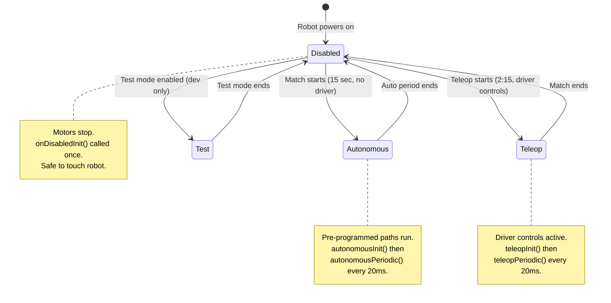
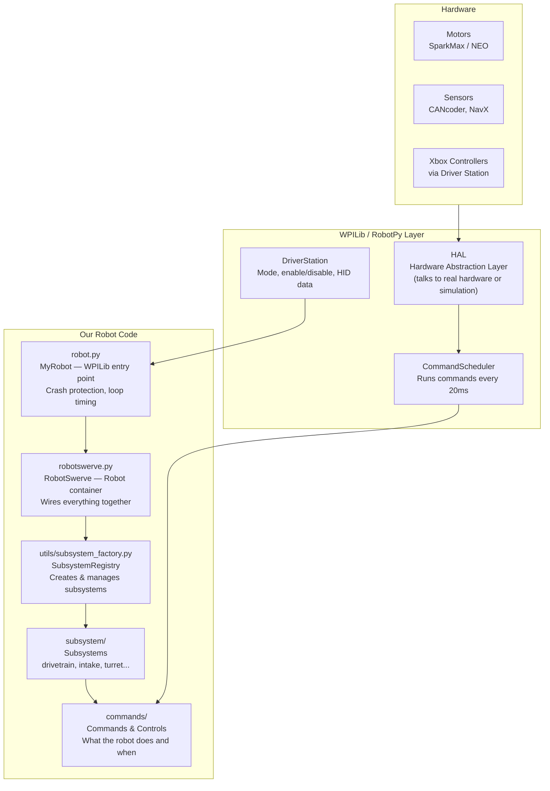
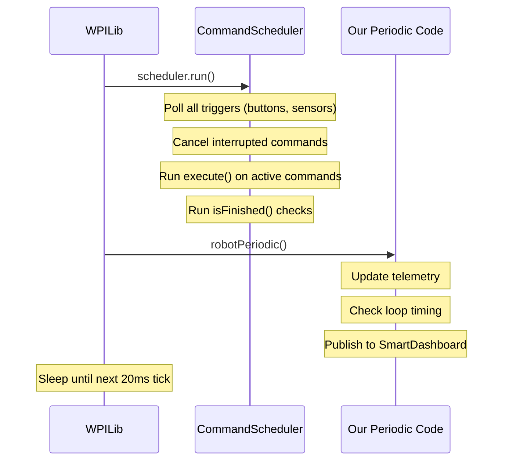
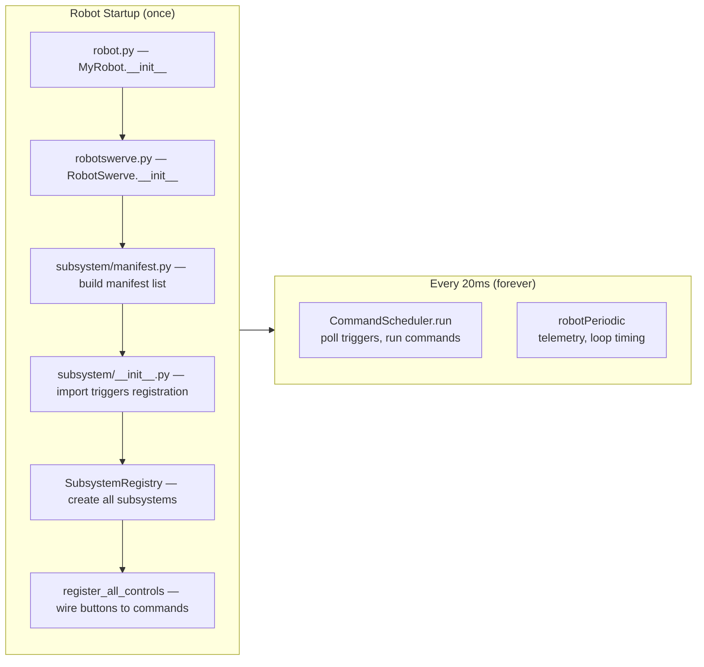

# Architecture Overview

This document explains how the Raptacon 2026 robot software is structured at a high level. It's designed to give you the mental model you need before diving into any individual file.

If you're completely new, read [Getting Started](../getting-started.md) first to get your environment set up.

---

## The Big Idea: A Robot is a State Machine

Before we look at any code, let's understand what a robot program actually does.

An FRC robot is always in one of four **modes**. It can only be in one mode at a time, and the Driver Station controls which mode it's in:



The **20ms loop** (50 times per second) is the heartbeat of the robot. WPILib calls your `periodic()` functions on this schedule. Your code must finish within 20ms or the robot will log a loop overrun warning.

---

## The Software Stack

Here's how the layers connect — from the physical hardware up to your Python code:



---

## Key Concepts (5 Things to Understand)

### 1. Subsystems — Hardware Wrappers

A **Subsystem** wraps one physical mechanism. The `IntakeSubsystem` owns the intake motor. The `SwerveDrivetrain` owns the four drive motors and the gyroscope. Subsystems:
- Create and configure hardware objects (motors, sensors)
- Expose methods to DO things (`set_speed()`, `get_angle()`)
- Tell the scheduler what hardware they own (so two commands can't fight over the same motor)

See: `subsystem/` directory

### 2. Commands — Units of Work

A **Command** describes an action that uses one or more subsystems. "Run the intake for 2 seconds." "Drive forward 1 meter." "Aim the turret at target." Commands:
- Have a lifecycle: `initialize()` → `execute()` (every 20ms) → `isFinished()` → `end()`
- Declare which subsystems they require
- Can be canceled if a higher-priority command needs the same subsystem

**This is the most important concept in FRC programming.** See: [Commands V2](commands-v2.md)

### 3. Triggers — The Glue

A **Trigger** connects a condition (button pressed, sensor reading) to a command. When the condition becomes true, the command runs. Our controls files (`commands/*_controls.py`) are full of trigger bindings:

```python
# When operator presses A button, run the IntakeCommand
operator.a().whileTrue(IntakeCommand(intake_subsystem))
```

### 4. The Subsystem Registry — Safe Startup

Our robot uses a **registry pattern** to create subsystems safely. Each subsystem registers itself when its module is imported. The registry:
- Creates subsystems in dependency order (swerve modules before drivetrain)
- Reads NetworkTables to check if a subsystem should be enabled/disabled
- Continues gracefully if a non-critical subsystem fails to create

This means a broken intake motor won't prevent the robot from driving. See: [Subsystem Registry](subsystem-registry.md)

### 5. The 20ms Loop Budget

The robot loop runs every 20ms. Here's what happens in each iteration:



---

## How the Files Connect



---

## The Robot Lifecycle in Code

When you power on the robot, here's what runs:

```python
# robot.py — WPILib calls this
class MyRobot(commands2.TimedCommandRobot):
    def __init__(self):
        super().__init__()           # starts the 20ms scheduler
        MyRobot.container = RobotSwerve()   # builds everything

# robotswerve.py — our robot container
class RobotSwerve:
    def __init__(self):
        self.factory = InputFactory(...)    # load controller config
        manifest = build_manifest(...)      # which subsystems to create
        self.registry = SubsystemRegistry(manifest, container=self)
        self.registry.register_all_controls()  # wire button bindings
```

Then for every 20ms tick:
```python
# robot.py delegates each mode to robotswerve.py
def teleopPeriodic(self):
    self.container.teleopPeriodic()  # → registry.run_all_teleop_periodic()
```

---

## File Map

| File | Role |
|---|---|
| `robot.py` | WPILib entry point. Loop timing, crash protection, mode delegation. |
| `robotswerve.py` | Robot container. Builds subsystems, wires everything, implements mode methods. |
| `subsystem/__init__.py` | One import per subsystem. Importing triggers `register_subsystem()`. |
| `subsystem/manifest.py` | Maps robot names to subsystem lists. Topological dependency sort. |
| `utils/subsystem_factory.py` | `SubsystemEntry`, `SubsystemFactory`, `SubsystemRegistry` — the core of our startup architecture. |
| `utils/loop_timing.py` | Measures how long user code and the scheduler take each cycle. |
| `constants/` | Physical hardware constants: gear ratios, CAN IDs, conversion factors. |
| `config.py` | Tunable parameters: PID gains, thresholds. Changed by operators, not engineers. |
| `commands/*_controls.py` | One file per subsystem. Wires buttons and axes to commands. |
| `data/` | Config files: controller YAML, PathPlanner paths. |
| `tests/` | Automated tests. Run with `python -m robotpy test`. |

---

## Go Deeper

- [Commands V2](commands-v2.md) — The most important concept to understand. Start here.
- [Subsystem Registry](subsystem-registry.md) — How our safe startup system works and why we built it.
- [Adding a Subsystem](adding-a-subsystem.md) — Step-by-step guide to adding your own mechanism.
- [Testing](testing.md) — How to write tests and what our CI pipeline does.
- [Git Workflow](git-workflow.md) — Branches, pull requests, CI, and how code gets merged.

External:
- [WPILib Command-Based Programming](https://docs.wpilib.org/en/stable/docs/software/commandbased/index.html)
- [RobotPy Commands V2](https://robotpy.readthedocs.io/projects/commands-v2/en/stable/)
- [Skills Challenges](https://github.com/Raptacon/Skills-Challenges) — Practice exercises to build these skills step by step.
