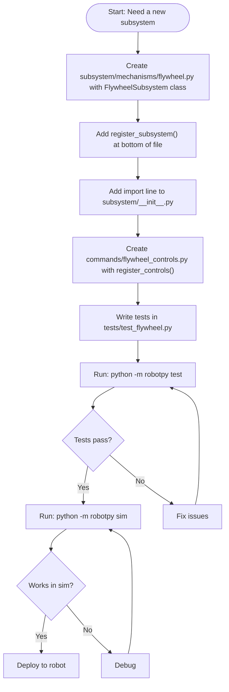

# Adding a New Subsystem: Step-by-Step Guide

This guide walks you through adding a brand-new subsystem to the robot codebase using the registry pattern used by Team 3200. We will use a **flywheel shooter** as the example — a spinning wheel that launches game pieces.

By the end you will have:
- A subsystem class that controls a motor
- Automatic telemetry published to the dashboard
- Operator button bindings
- Unit tests you can run without a robot

For deeper context on the registry design, see
[`docs/architecture/subsystem-registry.md`](subsystem-registry.md).
For Commands v2 patterns, see [`docs/architecture/commands-v2.md`](commands-v2.md).

---

## How the Registry Works (Quick Version)

Each subsystem file **registers itself** by calling `register_subsystem()` at the bottom of the file. That call runs when Python imports the file. You add one import line to `subsystem/__init__.py` so the file gets imported at startup. The registry then handles creation, telemetry, controls wiring, and disabled behavior — automatically, by convention.

You do **not** need to edit `robotswerve.py` or any manifest file to add a new subsystem.



---

## Step 1: Create the Subsystem Class

Create the file `subsystem/mechanisms/flywheel.py`.

Mechanism subsystems live in `subsystem/mechanisms/` to keep things organized. Simple subsystems that do not control a mechanism (such as a vision camera wrapper) can go directly in `subsystem/`.

```python
# subsystem/mechanisms/flywheel.py

import commands2
import wpilib
from rev import SparkMax, SparkMaxConfig, SparkLowLevel, SparkBaseConfig


class FlywheelSubsystem(commands2.Subsystem):
    """Controls the flywheel shooter motor."""

    def __init__(self) -> None:
        super().__init__()

        # Create the motor controller (SparkMax driving a NEO brushless motor)
        # CAN ID 10 — check subsystem/CAN_CONFIG.md and pick an unused ID
        self._motor = SparkMax(10, SparkLowLevel.MotorType.kBrushless)

        # Configure the motor
        config = SparkMaxConfig()
        (
            config
            .setIdleMode(SparkBaseConfig.IdleMode.kCoast)  # coast to stop (safer for flywheels)
            .voltageCompensation(12.0)
            .smartCurrentLimit(40)
        )
        self._motor.configure(
            config,
            SparkMax.ResetMode.kResetSafeParameters,
            SparkMax.PersistMode.kNoPersistParameters,
        )

        # Encoder for reading back the actual speed
        self._encoder = self._motor.getEncoder()

        # NetworkTables entry for the dashboard
        # Use a path like "Flywheel/Speed" so it groups nicely in Shuffleboard
        self._speed_entry = wpilib.SmartDashboard.getEntry("Flywheel/Speed")

    # ------------------------------------------------------------------
    # Public API — these are the methods commands will call
    # ------------------------------------------------------------------

    def set_speed(self, speed: float) -> None:
        """Set motor duty cycle.

        Args:
            speed: motor output from -1.0 (full reverse) to 1.0 (full forward)
        """
        self._motor.set(speed)

    def get_speed(self) -> float:
        """Return current encoder velocity in RPM."""
        return self._encoder.getVelocity()

    def stop(self) -> None:
        """Stop the flywheel motor."""
        self._motor.set(0)

    # ------------------------------------------------------------------
    # Lifecycle hooks — called automatically by the registry
    # ------------------------------------------------------------------

    def updateTelemetry(self) -> None:
        """Called every loop by the registry. Publish data to the dashboard."""
        self._speed_entry.setDouble(self.get_speed())

    def onDisabledInit(self) -> None:
        """Called automatically when the robot enters disabled mode."""
        self.stop()
```

### Key Points

- **`commands2.Subsystem`** is the base class for all robot subsystems. It registers the subsystem with the command scheduler so commands can require it and prevent conflicts.
- **`updateTelemetry()`** — if this method exists, the registry calls it every loop. Use it to send data to Shuffleboard/SmartDashboard so drivers and programmers can see what the mechanism is doing.
- **`onDisabledInit()`** — if this method exists, the registry calls it when the robot disables. Always stop motors here so the robot does not keep moving when disabled.
- **CAN IDs** — check `subsystem/CAN_CONFIG.md` to find an unused ID before picking one.

---

## Step 2: Register the Subsystem

At the **bottom** of `flywheel.py`, after the class definition, add:

```python
# subsystem/mechanisms/flywheel.py  (continued at the bottom)

from utils.subsystem_factory import register_subsystem, SubsystemState


register_subsystem(
    name="flywheel",
    default_state=SubsystemState.enabled,
    creator=lambda subs: FlywheelSubsystem(),
)
```

### What This Does

`register_subsystem()` adds a `SubsystemEntry` to a global list. This runs **at import time** — when Python loads this file. No instance is created yet; just the recipe for creating one is stored.

When the robot starts, the registry reads that list, topologically sorts it (so dependencies are built first), and calls each `creator` function to actually build the subsystems.

### Choosing a `default_state`

| State | Meaning |
|---|---|
| `SubsystemState.enabled` | Try to create it. If it fails (e.g., motor not found), log the error and keep going. The robot stays functional. |
| `SubsystemState.required` | If it fails to create, raise an exception and stop the robot. Use this for subsystems the robot cannot function without (like the drivetrain). |
| `SubsystemState.disabled` | Skip entirely. Useful to temporarily turn something off. |

For a flywheel, `enabled` is the right choice. If the flywheel motor is unplugged, the robot should still drive.

> **Note:** The state can also be overridden at runtime via NetworkTables (under `/subsystem/flywheel`), so you can disable a broken subsystem from the dashboard without changing code.

---

## Step 3: Add the Import to `subsystem/__init__.py`

Open `subsystem/__init__.py` and add one line:

```python
# subsystem/__init__.py

import subsystem.drivetrain.swerve2026Chassis   # registers swerve_module_* (4 entries)
import subsystem.drivetrain.swerve_drivetrain   # registers "drivetrain" (depends on modules)
import subsystem.intakeactions                   # noqa: F401 registers "intake"
import subsystem.mechanisms.turret              # noqa: F401 registers "turret"
import subsystem.mechanisms.flywheel            # noqa: F401 registers "flywheel"  <-- ADD THIS
```

### Why This Is Enough

The manifest builder (`subsystem/manifest.py`) calls `import subsystem` when building the competition manifest. That triggers `subsystem/__init__.py`, which imports your file, which runs `register_subsystem()`. The registry then has your entry and will create it.

The `# noqa: F401` comment tells the linter not to complain about an "unused import" — importing for side effects (registration) is the whole point.

---

## Step 4: Create the Controls File

The controls file wires operator controller buttons to flywheel commands. Create `commands/flywheel_controls.py`:

```python
# commands/flywheel_controls.py

from commands2 import cmd
from commands2.button import CommandXboxController


def register_controls(flywheel, container):
    """Wire operator controller buttons to the flywheel subsystem.

    Args:
        flywheel: the FlywheelSubsystem instance
        container: the robot container (RobotSwerve) — use it to access
                   shared controllers or other subsystems
    """
    # Controller port 1 = operator controller (port 0 is typically driver)
    operator = CommandXboxController(1)

    # Hold right bumper to spin the flywheel at 80% speed.
    # Release the bumper (or interrupt with another command) to stop.
    operator.rightBumper().whileTrue(
        cmd.startEnd(
            lambda: flywheel.set_speed(0.8),   # called once when the button is pressed
            lambda: flywheel.stop(),            # called once when button is released
            flywheel                            # declares that this command requires flywheel
        )
    )

    # Hold left bumper to spin in reverse (e.g., to clear a jam)
    operator.leftBumper().whileTrue(
        cmd.startEnd(
            lambda: flywheel.set_speed(-0.3),
            lambda: flywheel.stop(),
            flywheel
        )
    )
```

### How the Registry Finds This File

The registry calls `importlib.import_module("commands.flywheel_controls")` for each active subsystem named `"flywheel"`. The filename **must match** the subsystem name: `commands/{name}_controls.py`. If the file does not exist, the registry skips it quietly — controls are optional.

### Understanding `cmd.startEnd()`

`cmd.startEnd(on_start, on_end, *requirements)` is a shortcut that creates a command which:
1. Calls `on_start` once when the command begins (button pressed)
2. Keeps running until interrupted
3. Calls `on_end` once when it ends (button released or interrupted)

It is the simplest pattern for "hold button to run motor, release to stop."

### The `container` Parameter

`container` is the robot container object (`RobotSwerve`). You can use it to access shared resources like a driver controller or another subsystem. For example, if a button is already defined on the driver's controller in the container, use `container.some_button` instead of creating a new controller object.

### Optional Hooks

Controls files can also export `teleop_init(flywheel, container)` and `teleop_periodic(flywheel, container)`. The registry calls these automatically. See `commands/drivetrain_controls.py` for an example of `teleop_init` setting a default command.

---

## Step 5: Write Tests

Tests for subsystems live in `tests/test_{name}.py`. Create `tests/test_flywheel.py`:

```python
# tests/test_flywheel.py
# Generated by Claude.
#
# Tests for FlywheelSubsystem.
# Uses rev.SparkSim to simulate the motor without real hardware.

import pytest
import rev
import wpilib.simulation
from wpimath.system.plant import DCMotor

from subsystem.mechanisms.flywheel import FlywheelSubsystem


# --- Fixtures ---

# scope="module" means the subsystem is created once for the whole file.
# SparkMax objects cannot be created with the same CAN ID more than once
# per process, so module scope is required.
@pytest.fixture(scope="module")
def flywheel():
    """Create a FlywheelSubsystem in simulation."""
    wpilib.simulation.pauseTiming()
    sub = FlywheelSubsystem()
    yield sub
    wpilib.simulation.resumeTiming()


@pytest.fixture(scope="module")
def motor_sim(flywheel):
    """Get the SparkMax simulation object for the flywheel motor."""
    return rev.SparkSim(flywheel._motor, DCMotor.NEO())


@pytest.fixture(scope="module")
def encoder_sim(motor_sim):
    """Get the simulated encoder from the motor sim."""
    return motor_sim.getRelativeEncoderSim()


@pytest.fixture(autouse=True)
def _reset(flywheel):
    """Stop the flywheel before each test to start from a clean state."""
    flywheel.stop()


# --- Construction ---

def test_motor_is_spark_max(flywheel):
    """FlywheelSubsystem should create a SparkMax motor controller."""
    assert isinstance(flywheel._motor, rev.SparkMax)


# --- Speed control ---

def test_set_speed_positive(flywheel):
    """set_speed should command the motor forward."""
    flywheel.set_speed(0.5)
    # In simulation, motor.get() returns the last commanded duty cycle
    assert flywheel._motor.get() == pytest.approx(0.5)


def test_set_speed_negative(flywheel):
    """set_speed should command the motor in reverse."""
    flywheel.set_speed(-0.3)
    assert flywheel._motor.get() == pytest.approx(-0.3)


def test_stop_zeroes_motor(flywheel):
    """stop() should set motor output to zero."""
    flywheel.set_speed(1.0)
    flywheel.stop()
    assert flywheel._motor.get() == pytest.approx(0.0)


# --- Encoder ---

def test_get_speed_reads_encoder(flywheel, encoder_sim):
    """get_speed() should return the simulated encoder velocity."""
    encoder_sim.setVelocity(3000.0)
    assert flywheel.get_speed() == pytest.approx(3000.0)


# --- Lifecycle hooks ---

def test_on_disabled_init_stops_motor(flywheel):
    """onDisabledInit() should stop the motor."""
    flywheel.set_speed(0.8)
    flywheel.onDisabledInit()
    assert flywheel._motor.get() == pytest.approx(0.0)


def test_update_telemetry_does_not_raise(flywheel):
    """updateTelemetry() should publish without raising exceptions."""
    flywheel.updateTelemetry()  # just verify no crash


# --- Registry ---

def test_flywheel_is_registered():
    """FlywheelSubsystem should have registered itself with the global registry."""
    from utils.subsystem_factory import get_registered_entries
    names = [e.name for e in get_registered_entries()]
    assert "flywheel" in names
```

### Key Testing Patterns

- **`rev.SparkSim`** — gives you a simulated view of a SparkMax. You can read what duty cycle was commanded and set simulated encoder values.
- **`scope="module"`** — SparkMax objects are identified by CAN ID. You cannot create two instances with the same ID in one process, so always use module scope for fixtures that create subsystems.
- **`autouse=True` reset fixture** — resets state before each test so tests do not interfere with each other.
- **Registry test** — checks that `register_subsystem()` was actually called at the bottom of the file. Useful to catch the mistake of forgetting the registration block.

---

## Step 6: Run the Tests

```bash
python -m robotpy test -- tests/test_flywheel.py -v
```

The `--` separates robotpy arguments from pytest arguments. `-v` gives verbose output so you can see each test by name.

To run all tests (as CI does):

```bash
python -m robotpy coverage test
```

See the [pyfrc documentation](https://robotpy.readthedocs.io/projects/pyfrc/en/stable/) for more on writing and running simulation-based tests.

---

## Step 7: Run in the Simulator

```bash
python -m robotpy sim
```

The simulator opens a window with a Joystick panel and a robot display. You can:
- Enable the robot in Teleop mode and press the right bumper to spin the flywheel
- Open Shuffleboard or Glass and navigate to `Flywheel/Speed` to see the telemetry

If the simulator crashes on startup, check the Python traceback — it will tell you exactly which file and line failed.

---

## Checklist

Use this checklist when adding any new subsystem:

- [ ] Created `subsystem/mechanisms/mysubsystem.py` with a class extending `commands2.Subsystem`
- [ ] Added `updateTelemetry()` method (optional, but highly recommended)
- [ ] Added `onDisabledInit()` method to stop motors on disable
- [ ] Added `register_subsystem(name=..., default_state=..., creator=...)` at the bottom of the file
- [ ] Added `import subsystem.mechanisms.mysubsystem  # noqa: F401` to `subsystem/__init__.py`
- [ ] Created `commands/mysubsystem_controls.py` with `register_controls(subsystem, container)`
- [ ] Wrote tests in `tests/test_mysubsystem.py`
- [ ] Tests pass: `python -m robotpy test -- tests/test_mysubsystem.py -v`
- [ ] Works in simulator: `python -m robotpy sim`
- [ ] Linter is clean: `make lint`
- [ ] Checked CAN ID against `subsystem/CAN_CONFIG.md`

---

## What About Dependencies?

If your subsystem needs another subsystem to already exist, declare a dependency. The registry uses a **topological sort** to guarantee dependencies are created first — it figures out the right creation order automatically, even for chains of dependencies. See [Subsystem Registry — Dependency Resolution](subsystem-registry.md#4-dependency-resolution) for how this works.

For example, if a `ShooterHood` needs to know about the flywheel to coordinate timing:

```python
# subsystem/mechanisms/shooter_hood.py (bottom of file)

from utils.subsystem_factory import register_subsystem, SubsystemState


register_subsystem(
    name="shooter_hood",
    default_state=SubsystemState.enabled,
    creator=lambda subs: ShooterHood(flywheel=subs["flywheel"]),
    dependencies=["flywheel"],  # "flywheel" will be in subs when creator() is called
)
```

The `subs` dict passed to `creator` contains all **already-created** subsystems. If `"flywheel"` failed to create and is `None`, the registry will log a warning and skip `"shooter_hood"` entirely (because the dependency is missing). This is the correct behavior — do not create the hood if there is no flywheel.

> **Important:** The string in `dependencies` must exactly match the `name` used in `register_subsystem()`. A typo will cause the dependency check to fail and the subsystem to be skipped. See the Troubleshooting section below.

---

## What If My Subsystem Is Required?

Use `SubsystemState.required` for subsystems that the robot absolutely cannot operate without. If a required subsystem fails to create, the robot will raise an exception and stop instead of silently degrading.

The drivetrain uses `required`:

```python
register_subsystem(
    name="drivetrain",
    default_state=SubsystemState.required,  # robot cannot function without this
    creator=lambda subs: SwerveDrivetrain(...),
    dependencies=["swerve_module_fl", "swerve_module_fr",
                  "swerve_module_bl", "swerve_module_br"],
)
```

Most mechanisms should use `enabled`. A robot with a broken flywheel can still drive. A robot with a broken drivetrain cannot do anything useful.

---

## Troubleshooting

### "Subsystem not found" or subsystem is `None` everywhere

You probably forgot the import line in `subsystem/__init__.py`. Without it, `register_subsystem()` never runs and the entry never appears in the registry.

Check: does `subsystem/__init__.py` have a line importing your file?

### "Subsystem 'shooter_hood' skipped: missing dependencies ['flywheel']"

The dependency name is misspelled, or `"flywheel"` itself failed to create. Check:
1. The string in `dependencies=[...]` exactly matches the `name=` in the flywheel's `register_subsystem()` call.
2. The flywheel created successfully (look earlier in the log for flywheel errors).

### Motor not found / CAN timeout

The CAN ID in your subsystem does not match the physical motor. Check:
- `subsystem/CAN_CONFIG.md` for the ID assignment
- The motor's physical CAN ID (set via REV Hardware Client or Phoenix Tuner)
- That the motor is actually plugged in and powered

In simulation, SparkMax creates successfully regardless of CAN ID. The error only appears on real hardware.

### Tests fail with "cannot import name X"

Make sure all imports in your subsystem file are available. Hardware-specific imports (`rev`, `phoenix6`) are available in simulation because robotpy installs simulation stubs. If you import something that is not in `requirements.txt`, add it.

### Tests fail in CI but pass locally

CI runs on Windows. Check for:
- File path casing differences (Windows is case-insensitive, Linux is not)
- Dependencies on local files not committed to git

### The linter complains about the import in `__init__.py`

Add `# noqa: F401` to the end of the import line. This tells flake8 that the import is intentional (importing for the side effect of registration), not a mistake.

```python
import subsystem.mechanisms.flywheel  # noqa: F401 registers "flywheel"
```
