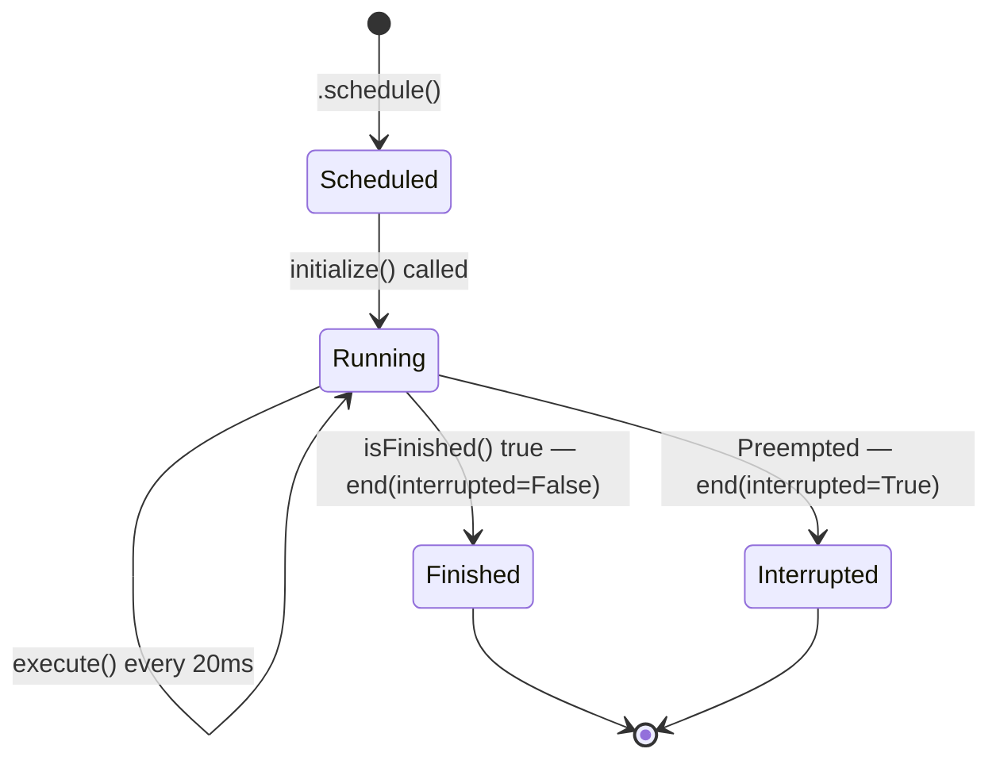
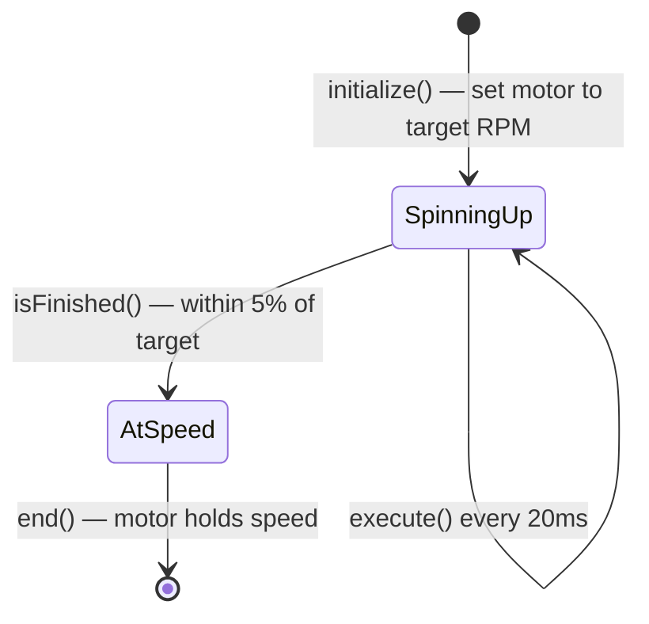
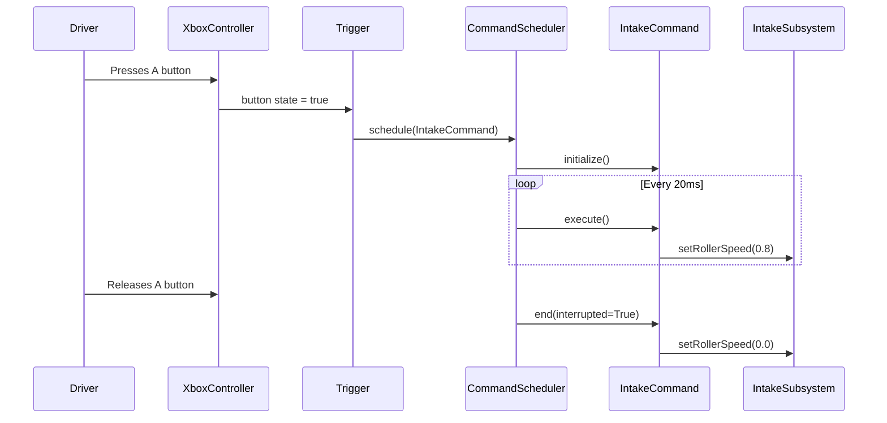
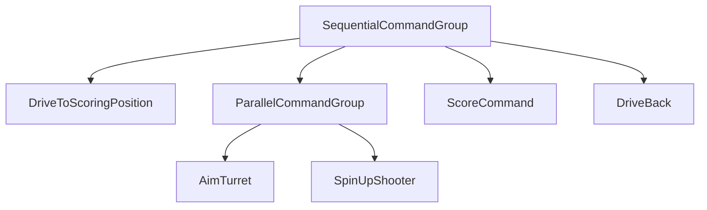

# WPILib Commands V2: A Practical Guide for FRC Programmers

**Team Raptacon (3200) — Season 2026**

This guide is written for students who are new to robot programming or who want a deeper understanding of how the Commands V2 framework organizes robot code. We will use our own robot's code as examples throughout.

---

## Table of Contents

1. [Why Commands Exist](#1-why-commands-exist)
2. [What is a Subsystem?](#2-what-is-a-subsystem)
3. [What is a Command?](#3-what-is-a-command)
4. [Commands Are State Machines](#4-commands-are-state-machines)
5. [Trigger Bindings: Connecting Buttons to Commands](#5-trigger-bindings-connecting-buttons-to-commands)
6. [Command Composition: Building Bigger Behaviors](#6-command-composition-building-bigger-behaviors)
7. [Real Examples from Our Code](#7-real-examples-from-our-code)
8. [Common Mistakes](#8-common-mistakes)
9. [Connecting to Skills Challenges](#9-connecting-to-skills-challenges)
10. [Further Reading](#further-reading)

---

## 1. Why Commands Exist

### The Naive Approach

When you first start writing robot code, it is tempting to put everything directly in a loop:

```python
def teleopPeriodic(self):
    if self.controller.getAButton():
        self.intake.setRollerSpeed(0.8)
    if self.controller.getBButton():
        self.intake.setRollerSpeed(-0.5)   # eject
```

This works for a very simple robot. But problems start piling up quickly.

**Problem 1: Two things fight over the same hardware.**
What if the driver presses A and B at the same time? Both branches run. The motor gets set to 0.8 and then immediately overwritten to -0.5 in the same 20ms cycle. The behavior is undefined and hard to debug.

**Problem 2: Autonomous and teleop can conflict.**
Autonomous might be driving the robot while teleopPeriodic is also running. You need special flags everywhere (`if self.isAuto: ...`), and they get messy fast.

**Problem 3: Multi-step sequences are painful.**
Imagine a scoring sequence: drive forward, aim the turret, spin up the shooter, wait for speed, then fire. Doing this with flags and counters in a loop is error-prone and hard to read.

### The Solution: Commands

Commands V2 is the framework that solves all of these. The key idea is simple:

> **Only one command may use a given piece of hardware at a time. The scheduler enforces this automatically.**

A good analogy: think of a subsystem as an **office printer**. Multiple people might want to print at the same time, but the printer can only handle one job. So print jobs go into a queue. The current job runs to completion (or is cancelled), and then the next one starts. Nobody has to coordinate manually — the printer management software handles it.

In robot code:
- **Subsystems** are the shared hardware (the printer)
- **Commands** are the jobs (print requests)
- **CommandScheduler** is the print queue manager

---

## 2. What is a Subsystem?

A subsystem represents **one physical component** of the robot: an intake, a drivetrain, a turret, a climber. It owns all the hardware objects (motors, encoders, sensors) for that component and exposes methods to act on them.

Here is a simple example of an intake subsystem:

```python
import commands2
from rev import SparkMax, SparkMaxConfig

class IntakeSubsystem(commands2.Subsystem):
    def __init__(self):
        super().__init__()
        # Hardware lives here
        self.deploy_motor = SparkMax(10, SparkMax.MotorType.kBrushless)
        self.roller_motor = SparkMax(11, SparkMax.MotorType.kBrushless)

    def deploy(self):
        """Extend the intake arm."""
        self.deploy_motor.set(0.5)

    def retract(self):
        """Retract the intake arm."""
        self.deploy_motor.set(-0.5)

    def setRollerSpeed(self, speed: float):
        """Spin the intake rollers. Positive = intake, negative = eject."""
        self.roller_motor.set(speed)

    def stop(self):
        """Stop all motors."""
        self.deploy_motor.set(0.0)
        self.roller_motor.set(0.0)
```

A few important points:

- The subsystem **does not decide when to run**. It just exposes methods.
- The subsystem **does not hold any game logic**. That belongs in commands.
- You create the subsystem once (usually in your robot container) and pass it around.

When a command uses a subsystem, it declares that relationship by calling `self.addRequirements(subsystem)` in its constructor. This is how the scheduler knows which commands are competing for the same hardware.

---

## 3. What is a Command?

A command is a **unit of work** that uses one or more subsystems. It has a defined start, a repeating body, and an end. Commands are the building blocks of all robot behavior.

Every command has four lifecycle methods:

| Method | When it runs | What to put here |
|---|---|---|
| `initialize()` | Once, when the command is first scheduled | Setup: reset timers, set initial motor states |
| `execute()` | Every 20ms while the command is active | The ongoing action: drive, spin, aim |
| `isFinished()` | Every 20ms, checked after `execute()` | The exit condition: are we done yet? |
| `end(interrupted)` | Once, when the command ends or is cancelled | Cleanup: stop motors, reset state |

Here is what that looks like for an intake command:

```python
import commands2

class RunIntakeCommand(commands2.Command):
    def __init__(self, intake: IntakeSubsystem):
        super().__init__()
        self.intake = intake
        self.addRequirements(self.intake)  # declare hardware use

    def initialize(self):
        self.intake.deploy()

    def execute(self):
        self.intake.setRollerSpeed(0.8)

    def isFinished(self) -> bool:
        return False  # runs until interrupted (e.g., button released)

    def end(self, interrupted: bool):
        self.intake.stop()
```

### Command Lifecycle Diagram



The `interrupted` flag in `end()` tells your cleanup code whether you finished normally or were cancelled. This matters: if you were interrupted mid-sequence, you might want to take a different recovery action.

---

## 4. Commands Are State Machines

This section is the most important conceptual leap. Once you see it, the whole framework makes more sense.

### What is a Finite State Machine?

A **Finite State Machine (FSM)** is a model for something that can be in exactly one **state** at a time, and moves between states based on **conditions**.

Think of a traffic light:
- **States**: Red, Yellow, Green
- **Transitions**: Red -> Green after N seconds. Green -> Yellow. Yellow -> Red.
- **Actions**: While in Green, cars may proceed. While in Red, cars must stop.

FSMs are everywhere in robotics. A shooter might have states: *Idle*, *SpinningUp*, *AtSpeed*, *Firing*, *CoolingDown*.

### How a Command Maps to an FSM

A Command is exactly a single state in an FSM:

- `initialize()` — you just **entered** this state. Do the setup work.
- `execute()` — you are **inside** this state, running every 20ms.
- `isFinished()` — should you **leave** this state? Check the exit condition.
- `end()` — you are **leaving** this state. Clean up.

Here is a concrete example — a command that spins up a shooter flywheel to a target RPM:

```python
import commands2

class SpinUpShooter(commands2.Command):
    TARGET_RPM = 3000
    TOLERANCE_PERCENT = 0.05  # within 5%

    def __init__(self, shooter: ShooterSubsystem):
        super().__init__()
        self.shooter = shooter
        self.addRequirements(self.shooter)

    def initialize(self):
        # Enter the state: command the motor to target speed
        self.shooter.setTargetRPM(self.TARGET_RPM)

    def execute(self):
        # Every 20ms: the PID controller on the motor handles adjustment
        # We can also do soft adjustments here if needed
        pass

    def isFinished(self) -> bool:
        # Transition condition: are we close enough to target?
        current = self.shooter.getRPM()
        error = abs(current - self.TARGET_RPM) / self.TARGET_RPM
        return error < self.TOLERANCE_PERCENT

    def end(self, interrupted: bool):
        if interrupted:
            self.shooter.stop()
        # If not interrupted, we finished normally — caller holds the speed
```

Here is that same command expressed as a state diagram:



When you start building multi-step autonomous sequences, each step IS a command — which IS a state. The sequence of commands IS the FSM. This framing helps you design robot behavior more clearly.

---

## 5. Trigger Bindings: Connecting Buttons to Commands

Writing commands is only half the job. You also need to wire them to controller inputs.

### CommandXboxController and Triggers

WPILib wraps the Xbox controller in `commands2.button.CommandXboxController`. Each button on it is a `Trigger` — an object that watches a condition and fires commands when that condition changes.

```python
from commands2.button import CommandXboxController

controller = CommandXboxController(0)  # port 0
```

### Trigger Binding Methods

| Method | When the command runs |
|---|---|
| `.onTrue(cmd)` | Starts once when the button is first pressed |
| `.whileTrue(cmd)` | Runs while held; cancels when released |
| `.onFalse(cmd)` | Starts once when the button is released |
| `.toggleOnTrue(cmd)` | Alternates: pressed once = start, pressed again = cancel |

Examples:

```python
# Run the intake only while A is held
controller.a().whileTrue(RunIntakeCommand(intake))

# Fire once per button press
controller.rightBumper().onTrue(FireCommand(shooter))

# Toggle a light on/off
controller.x().toggleOnTrue(EnableLightCommand(lights))
```

### Default Commands

What runs when **no command** is currently using a subsystem? The default command. This is almost always used for the drivetrain, so the robot drives when nothing else is happening:

```python
drivetrain.setDefaultCommand(
    DefaultDrive(
        drivetrain,
        lambda: controller.getLeftY(),
        lambda: controller.getLeftX(),
        lambda: controller.getRightX(),
        lambda: True  # field-relative
    )
)
```

The default command is automatically cancelled whenever another command requires that subsystem, and automatically restarted when the subsystem is free again.

### Sequence Diagram: Button Press to Command Execution

Here is exactly what happens when a driver presses a button:



Notice that the driver never directly touches the subsystem. The command is the intermediary, and the scheduler manages the timing.

---

## 6. Command Composition: Building Bigger Behaviors

Individual commands are small and focused. The real power comes from **combining them** into groups.

### SequentialCommandGroup

Run commands one after another. Command B starts only after Command A finishes.

```python
import commands2

commands2.SequentialCommandGroup(
    DriveToPosition(drivetrain, target_pose),
    SpinUpShooter(shooter),
    FireCommand(shooter),
    DriveBack(drivetrain),
)
```

### ParallelCommandGroup

Run multiple commands at the same time. The group finishes when **all** of them finish.

```python
commands2.ParallelCommandGroup(
    AimTurret(turret, target),
    SpinUpShooter(shooter),
)
```

Note: commands in a parallel group must use **different** subsystems. Two commands cannot both require the same subsystem.

### ParallelRaceGroup

Run multiple commands at the same time. The group finishes when **any one** of them finishes, and cancels the rest.

```python
# Run intake until either the sensor triggers OR 3 seconds pass
commands2.ParallelRaceGroup(
    RunIntakeUntilSensor(intake),
    commands2.WaitCommand(3.0),
)
```

### ParallelDeadlineGroup

Like a race, but **one specific command** is the deadline. The group ends when that deadline command finishes. All others are cancelled.

```python
# SpinUp is the deadline — aim and LEDs run alongside but are cut off when spin finishes
commands2.ParallelDeadlineGroup(
    SpinUpShooter(shooter),   # deadline
    AimTurret(turret, target),
    SetLEDs(leds, "spinning"),
)
```

### WaitCommand

A simple command that does nothing for N seconds. Useful as a pause in sequential groups.

```python
commands2.WaitCommand(1.5)  # wait 1.5 seconds
```

### Inline Shortcuts: cmd.runOnce() and cmd.run()

For simple actions you do not want to write a whole class for:

```python
import commands2.cmd as cmd

# Run a lambda once
cmd.runOnce(lambda: intake.stop(), intake)

# Run a lambda every 20ms until cancelled
cmd.run(lambda: intake.setRollerSpeed(0.5), intake)
```

These are great for quick trigger bindings in control files.

### Putting It Together: Auto Score Sequence

Here is a complete autonomous scoring sequence built from composition:



In code:

```python
def build_auto_score(drivetrain, turret, shooter):
    return commands2.SequentialCommandGroup(
        DriveToScoringPosition(drivetrain, scoring_pose),
        commands2.ParallelCommandGroup(
            AimTurret(turret, target),
            SpinUpShooter(shooter),
        ),
        ScoreCommand(shooter),
        DriveBack(drivetrain),
    )
```

Each piece is reusable. `SpinUpShooter` works the same whether it is called in auto or triggered by a button in teleop.

---

## 7. Real Examples from Our Code

### DefaultDrive (`commands/default_swerve_drive.py`)

`DefaultDrive` is our teleop driving command. It is the default command for the drivetrain subsystem, meaning it runs whenever no autonomous command is using the drivetrain.

Key things to notice:

```python
class DefaultDrive(commands2.Command):
    def __init__(self, drivetrain, velocity_vector_x, velocity_vector_y,
                 angular_velocity, field):
        super().__init__()
        self.drivetrain = drivetrain
        # Inputs are callables (lambdas), not values.
        # This means they are evaluated fresh every 20ms.
        self.velocity_vector_x = velocity_vector_x
        self.velocity_vector_y = velocity_vector_y
        self.angular_velocity = angular_velocity
        self.field = field
        self.addRequirements(self.drivetrain)  # declares drivetrain use
```

Notice that inputs are **callables** (functions), not raw values. Instead of reading the joystick once at construction, the command calls `self.velocity_vector_x()` each time `execute()` runs. This means it always has the current joystick position.

`DefaultDrive` has no `initialize()`, no `isFinished()` (defaults to `False`), and no `end()` — it just drives forever until interrupted. This is appropriate for a default teleop driving command.

### AutoDrive (`commands/autoDrive.py`)

`AutoDrive` is a time-based autonomous drive command. It shows a complete lifecycle:

```python
class AutoDrive(commands2.Command):
    def __init__(self, timeS, speedX, speedY, dir, fieldRel, drive):
        super().__init__()
        self.timeS = timeS
        self.drive = drive
        self.addRequirements(drive)

    def initialize(self):
        self.drive.reset_heading()
        self.timer = wpilib.Timer()
        self.timer.start()          # start the clock

    def execute(self):
        self.drive.drive(self.speedX, self.speedY, self.dir, self.fieldRel)

    def end(self, interrupted):
        self.drive.drive(0, 0, 0, False)   # always stop on exit

    def isFinished(self):
        return self.timer.hasElapsed(self.timeS)  # done when time is up
```

This is a textbook example: `initialize()` sets up the timer, `execute()` drives, `isFinished()` checks the timer, and `end()` stops the robot.

### Controls Files (`commands/drivetrain_controls.py`)

Our codebase uses a convention where each subsystem has a matching `*_controls.py` file. This is where trigger bindings live. Here is how the drivetrain's controls file wires a trigger:

```python
from commands2.button import Trigger
import commands2

def register_controls(drivetrain, container):
    # After being disabled for 3 seconds, switch motors to brake mode
    Trigger(wpilib.DriverStation.isDisabled).debounce(3).onTrue(
        commands2.cmd.runOnce(
            lambda: drivetrain.set_motor_stop_modes(to_drive=True, to_break=True,
                                                    all_motor_override=True, burn_flash=True),
            drivetrain
        )
    )

def teleop_init(drivetrain, container):
    # Set the default drive command when teleop starts
    drivetrain.setDefaultCommand(
        DefaultDrive(
            drivetrain,
            container.translate_x,
            container.translate_y,
            container.rotate,
            lambda: not container.robot_relative_btn()
        )
    )
```

The `Trigger(wpilib.DriverStation.isDisabled)` line shows that triggers are not limited to buttons — any boolean-returning callable can be a trigger. `.debounce(3)` means the condition must be true continuously for 3 seconds before firing.

---

## 8. Common Mistakes

These are the mistakes that trip up almost every new programmer. Learn them now and save yourself hours of debugging.

### Mistake 1: Calling subsystem hardware directly from button callbacks

```python
# BAD — bypasses the scheduler entirely
def teleopPeriodic(self):
    if self.controller.getAButton():
        self.intake.roller_motor.set(0.8)  # direct motor access
```

The scheduler does not know this is happening. No requirement is declared, so two pieces of code can fight over the same motor silently.

**Fix:** Create a command and use a trigger binding. Let the scheduler manage it.

### Mistake 2: Forgetting to declare requirements

```python
class BadCommand(commands2.Command):
    def __init__(self, intake):
        super().__init__()
        self.intake = intake
        # Missing: self.addRequirements(self.intake)

    def execute(self):
        self.intake.setRollerSpeed(0.8)
```

Without `addRequirements`, the scheduler does not know this command uses the intake. Two commands can now run simultaneously and fight over the same motors. The symptoms are erratic motor behavior that is hard to reproduce.

**Fix:** Always call `self.addRequirements(...)` for every subsystem your command uses.

### Mistake 3: isFinished() always returns False

```python
def isFinished(self) -> bool:
    return False  # command runs forever
```

This is correct for default commands (like `DefaultDrive`). But if you intend the command to finish at some point — say, after the intake sensor triggers — returning `False` means it will run until something else cancels it. The robot might not behave as expected in auto sequences.

**Fix:** Return a meaningful condition, or make sure you understand that you are intentionally using a `whileTrue()` binding that handles cancellation for you.

### Mistake 4: isFinished() always returns True

```python
def isFinished(self) -> bool:
    return True  # command ends after one cycle
```

The command runs `initialize()` and then immediately `isFinished()` returns `True`, so `end()` is called after a single 20ms cycle. The motor was set for one tick and then stopped. Nothing appears to happen.

**Fix:** Make sure `isFinished()` checks an actual condition, and double-check it during testing with print statements or SmartDashboard values.

### Mistake 5: Not stopping motors in end()

```python
def end(self, interrupted: bool):
    pass  # forgot to stop motors
```

If the command is interrupted (e.g., a different command preempts it), the motors keep running at whatever speed `execute()` last set them to. This can cause the robot to continue moving unexpectedly.

**Fix:** Always stop or reset hardware in `end()`, at minimum for the `interrupted=True` case:

```python
def end(self, interrupted: bool):
    self.intake.stop()  # always safe to stop
```

---

## 9. Connecting to Skills Challenges

The best way to learn commands is to write them. The **Raptacon Skills Challenges** repository has practice exercises designed to reinforce exactly these concepts.

**Repository:** https://github.com/Raptacon/Skills-Challenges

### Suggested Connection: Cone Drill (West Coast Drive)

The cone drill exercise asks you to drive a robot through a sequence of waypoints. Each step in that sequence — "drive forward 2 meters," "turn 90 degrees," "drive to the next cone" — is a natural command. You write one command per step, then compose them with `SequentialCommandGroup`.

This maps directly to what you learned here:
- Each step is a state in a state machine
- `initialize()` sets the target
- `execute()` drives toward it
- `isFinished()` checks if you arrived
- `end()` stops the drive motors

Try building your cone drill solution using commands and command groups instead of a loop with flags. You will find it is easier to read, easier to debug, and easier to add new steps.

---

## Further Reading

| Resource | Link |
|---|---|
| WPILib Commands V2 docs | https://docs.wpilib.org/en/stable/docs/software/commandbased/index.html |
| RobotPy Commands V2 API | https://robotpy.readthedocs.io/projects/commands-v2/en/stable/ |
| Skills Challenges | https://github.com/Raptacon/Skills-Challenges |

The WPILib docs use Java and C++ examples, but the concepts translate directly to Python. Method names are identical; the only differences are Python syntax (snake_case method names, `def` instead of type declarations) and the `commands2` package name instead of `edu.wpi.first.wpilibj2`.

---

*This document is part of the Raptacon 2026 robot code documentation. For the subsystem registration system and how commands connect to the robot lifecycle, see [Subsystem Registry](subsystem-registry.md) and `utils/subsystem_factory.py`.*
