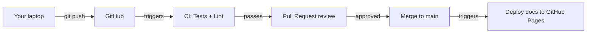
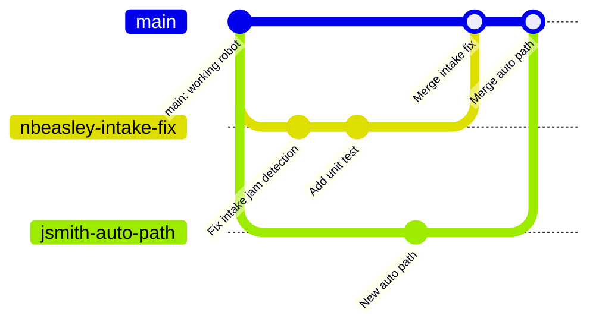
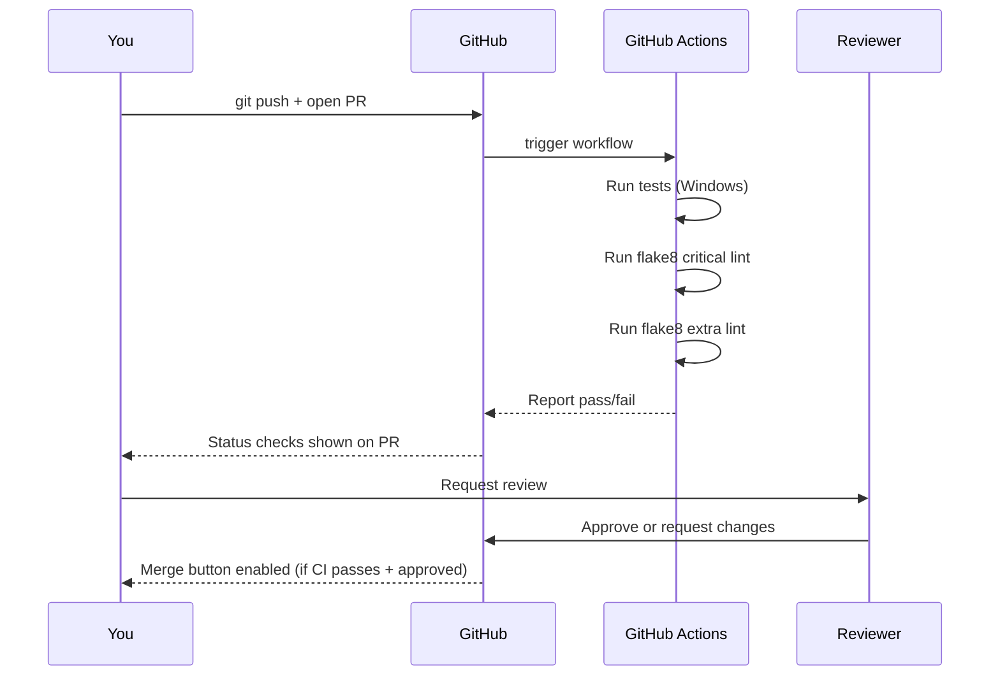

# Git Workflow: Branches, PRs, and CI

This guide covers how Team 3200 uses git to collaborate on robot code — from writing a feature to getting it merged into the main branch. If you are new to git, read through this before you start making changes.

---

## Why Version Control?

Imagine ten students editing the same robot code files. Without coordination, Person A's changes overwrite Person B's. Nobody knows what changed or why. If a bug appears, there is no way to go back.

**Git** solves this by:
- Tracking every change ever made, with who made it and why
- Letting multiple people work on different things at the same time
- Providing a clear process for reviewing and merging changes
- Making it possible to revert to any previous state

---

## The Big Picture



Code flows from your laptop → GitHub → CI checks → review → `main`. It never goes the other direction: you never edit code directly on GitHub's main branch.

---

## Branches

A **branch** is a parallel copy of the code where you can make changes without affecting anyone else. Think of the main branch as the "official" robot code, and your branch as your personal workspace.



Both developers worked at the same time without blocking each other. Their changes merged cleanly because they touched different files.

### Branch naming convention

Use your name or initials followed by a short description, connected by hyphens:

```
nbeasley-intake-fix
jsmith-auto-scoring-path
team-pre-competition-cleanup
```

---

## The Day-to-Day Workflow

### 1. Start from an up-to-date main

Before creating a new branch, make sure you have the latest code:

```bash
git checkout main
git pull origin main
```

### 2. Create your branch

```bash
git checkout -b yourname-feature-description
```

This creates the branch and switches to it in one step.

### 3. Write code and commit often

As you work, save checkpoints using commits:

```bash
git add .                              # stage all changed files
git commit -m "Add jam detection to intake"
```

Commit messages should describe **what changed and why**, not just what you did:

```
# Good:
"Fix intake jam detection — was triggering on first cycle before motor spun up"

# Not helpful:
"fix stuff"
"changes"
"asdfasdf"
```

### 4. Push your branch to GitHub

```bash
git push origin yourname-feature-description
```

The first time, git may ask you to set the upstream:
```bash
git push --set-upstream origin yourname-feature-description
```

After that, just `git push`.

### 5. Open a Pull Request (PR)

Go to the repository on GitHub. You will see a prompt to "Compare & pull request" for your recently pushed branch. Click it.

Fill in:
- **Title**: short summary of what the PR does
- **Description**: what changed, why, and anything reviewers should pay attention to

The PR is where the team sees your changes, discusses them, and decides whether to merge them.

### 6. CI runs automatically

As soon as you open the PR (and every time you push more commits), GitHub Actions runs the CI pipeline:



The status checks appear directly on the PR. A green checkmark means tests and critical lint passed. A red X means something is broken — you need to fix it and push again.

### 7. Address review feedback

Reviewers may leave comments asking questions or requesting changes. When you make fixes:

```bash
# Make your changes, then:
git add .
git commit -m "Address review feedback: check for None before accessing subsystem"
git push
```

The PR updates automatically. CI reruns. The conversation continues until reviewers approve.

### 8. Merge

Once CI passes and a reviewer approves, anyone with merge permissions can merge the PR. The branch is then deleted (GitHub offers a button for this). Your changes are now in `main`.

---

## Common Git Commands

| Command | What it does |
|---|---|
| `git status` | Show what files are changed, staged, or untracked |
| `git diff` | Show line-by-line changes not yet staged |
| `git log --oneline` | Show recent commits, one per line |
| `git checkout main` | Switch back to the main branch |
| `git pull origin main` | Fetch and merge latest changes from GitHub |
| `git stash` | Temporarily save uncommitted changes so you can switch branches |
| `git stash pop` | Restore the stashed changes |

---

## What CI Checks

The full CI pipeline (`.github/workflows/robot_ci.yml`) runs these jobs:

| Job | What it checks | Blocks merge? |
|---|---|---|
| Unit / Integration Tests (Windows) | `python -m robotpy coverage test` — all subsystem and fuzz tests | Yes |
| Critical Static Analysis | `flake8` — syntax errors, undefined names | Yes |
| Extra Static Analysis | `flake8` — complexity, line length, style | No (warning only) |
| Build Documentation | `python docs/build_docs.py` | Yes (after tests pass) |
| Deploy Documentation | Publishes to GitHub Pages | Only runs on `main` |

Tests run on **Windows** in CI (not macOS or Linux). This catches path-separator issues and Windows-specific behavior early.

---

## When Things Go Wrong

### Merge conflicts

A **merge conflict** happens when two branches changed the same lines in a file. Git cannot automatically decide which version to keep — you have to choose.

```bash
git pull origin main  # update your branch with latest main
# If conflicts appear:
#   - Open the conflicted files — look for <<<<<<, =======, >>>>>>>
#   - Edit to keep the right changes
#   - git add <conflicted-file>
#   - git commit
```

VS Code has a built-in merge conflict editor: click a conflicted file in the sidebar and use the "Accept Current Change" / "Accept Incoming Change" / "Accept Both" buttons.

### Accidentally committed to main

```bash
git checkout -b yourname-rescue-branch   # save your work to a new branch
git push origin yourname-rescue-branch
# Now open a PR from the rescue branch
```

Then on main:
```bash
git checkout main
git reset --hard origin/main   # reset to match GitHub's main (discards your local commit)
```

### CI fails

1. Click the red X on your PR → "Details" → read the failure output
2. The most common causes:
   - A test failed — find the test name in the output, run it locally
   - A lint error — run `make lint` locally and fix what it flags
3. Fix the issue, commit, and push — CI reruns automatically

---

## Keeping Your Branch Up to Date

If main has moved on since you created your branch, update yours:

```bash
git checkout main
git pull origin main
git checkout yourname-feature-description
git merge main
```

If there are conflicts, resolve them as described above. Keeping your branch current reduces the chance of conflicts at merge time.

---

## Quick Reference

```
main ──────────────────────────────────────────► (always stable, always deployable)
  └─ your-branch ──► commit ──► push ──► PR ──► CI ──► review ──► merge ──► main
```

1. `git checkout main && git pull origin main` — start fresh
2. `git checkout -b yourname-description` — create your branch
3. Edit code, `git add .`, `git commit -m "..."` — save checkpoints
4. `git push` — share your work
5. Open PR on GitHub — start the review
6. Fix CI failures and review feedback
7. Merge when approved

---

## Further Reading

- [Git Handbook (GitHub)](https://guides.github.com/introduction/git-handbook/) — beginner-friendly overview
- [Pro Git Book](https://git-scm.com/book/en/v2) — comprehensive reference, free online
- [Resolving merge conflicts](https://docs.github.com/en/pull-requests/collaborating-with-pull-requests/addressing-merge-conflicts) — GitHub's guide
- [Our CI workflow](../../.github/workflows/robot_ci.yml) — the actual workflow file
- [Testing guide](testing.md) — what tests CI runs and how to write new ones
