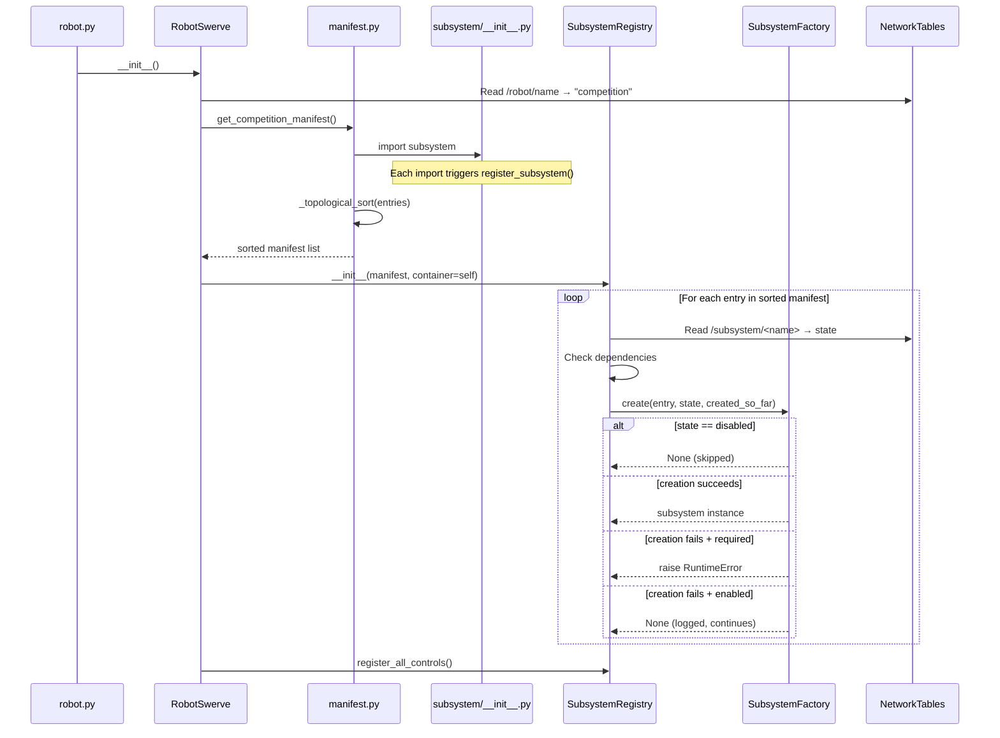
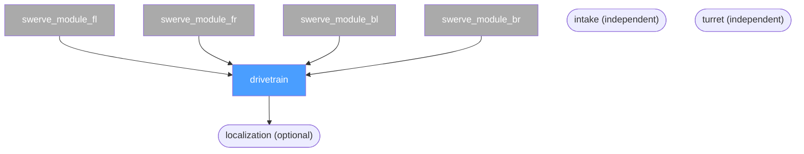

# Subsystem Registry

This document explains how Robot-2026 manages its subsystems — from "what is a subsystem?" to why the registry pattern makes competition day a lot less stressful.

If you are new to programming or new to FRC robot code, start at section 1. If you just need the quick reference for adding a new subsystem, jump to section 3.

---

## 1. The Problem: Fragile Robot Startup

### What is a subsystem?

In WPILib's Commands-based framework, a **subsystem** is a class that represents one piece of the robot — the drivetrain, an intake, a turret, etc. Subsystems hold references to motors, sensors, and any other hardware they control. See the [WPILib docs on subsystems](https://docs.wpilib.org/en/stable/docs/software/commandbased/subsystems.html) for the basics.

### The old way

Before the registry, `robotswerve.py` created every subsystem by hand in `__init__`:

```python
# OLD way — everything hardcoded in one place
def __init__(self):
    self.drivetrain = SwerveDrivetrain(...)
    self.intake = IntakeSubsystem(...)
    self.turret = Turret(...)
    # then manually wire all the controls...
    register_intake_controls(self.intake, self)
    register_turret_controls(self.turret, self)
    # ...
```

This looks fine until something goes wrong.

### What happens when hardware fails at a competition?

Imagine it's Saturday morning at a regional. Someone knocked a connector loose overnight and one intake motor won't respond. When `IntakeSubsystem()` tries to talk to that motor and gets an error, Python raises an exception. Because the exception is inside `__init__`, the entire robot fails to start. **You lose autonomous. You might lose the whole match.**

The core problem: one bad motor takes down the whole robot.

A second problem: every time you add a new mechanism, you have to edit `robotswerve.py` in exactly the right place, in the right order. Forget a dependency (like trying to create the drivetrain before the four swerve wheel modules exist) and you get a confusing crash.

> "We don't want to lose autonomous because one intake motor isn't plugged in."

---

## 2. The Solution: Registry Pattern

A **registry** is a list that things sign themselves up for. A **factory** is code that creates objects on demand, handling errors along the way.

Think of it like a restaurant kitchen:

- Each dish on the menu **registers itself** when the menu is printed. The kitchen doesn't need to know about every dish in advance.
- When a customer orders, the **kitchen (factory)** tries to make the dish. If one ingredient is missing, that dish gets an apology card — but the kitchen keeps cooking everything else.
- The **menu manifest** says what to cook and in what order (you can't plate a sauce before the base is ready).

In our robot:
- Each subsystem module **registers itself** when Python imports it.
- The **SubsystemFactory** tries to create each subsystem. If it fails and the subsystem is optional, it logs the error and moves on.
- The **manifest** declares which subsystems exist and their dependencies, ensuring they are created in the right order.

---

## 3. How Self-Registration Works

### Module-level code

In Python, code at the top level of a module (not inside a function or class) runs **the moment that module is imported**. We use this to register each subsystem automatically.

Here is what the bottom of `subsystem/intakeactions.py` looks like:

```python
# subsystem/intakeactions.py

class IntakeSubsystem(commands2.SubsystemBase):
    # ... all the intake logic ...
    pass


# ---------------------------------------------------------------------------
# Self-registration  (this runs when Python imports this file)
# ---------------------------------------------------------------------------
from utils.subsystem_factory import SubsystemState, register_subsystem

register_subsystem(
    name="intake",
    default_state=SubsystemState.enabled,
    creator=lambda subs: IntakeSubsystem(),
)
```

When Python imports `subsystem.intakeactions`, that `register_subsystem()` call runs immediately and adds an entry to a global list in `utils/subsystem_factory.py`.

### The trigger: `subsystem/__init__.py`

Python runs a package's `__init__.py` whenever you import the package. Ours is intentionally simple:

```python
# subsystem/__init__.py — adding one line here is all you need to register a new subsystem

import subsystem.drivetrain.swerve2026Chassis   # registers swerve_module_* (4 entries)
import subsystem.drivetrain.swerve_drivetrain   # registers "drivetrain"
import subsystem.intakeactions                   # registers "intake"
import subsystem.mechanisms.turret              # registers "turret"
```

Each import triggers that module's `register_subsystem()` call. By the time `import subsystem` finishes, every subsystem has added itself to the global registry.

### Step-by-step: what happens at startup



After the loop, `RobotSwerve` auto-populates itself with every successfully created subsystem:

```python
# robotswerve.py
for name, instance in self.registry.active_subsystems.items():
    setattr(self, name, instance)
# Now self.intake, self.drivetrain, etc. all exist (or are None if they failed)
```

---

## 4. Dependency Resolution

### Why does order matter?

Our swerve drivetrain is built from four independent wheel modules. The `SwerveDrivetrain` class needs references to all four modules when it is created. If `drivetrain` is created before the modules, it has nothing to connect to.

The registry solves this with a **topological sort** — a way of ordering a list so that every item comes after everything it depends on. This is a classic computer science problem: given a set of tasks where some tasks depend on others, what order should you run them in?

The specific algorithm our code uses is called **Kahn's algorithm**, named after Arthur Kahn who described it in 1962. It is one of the simplest and most efficient solutions to topological sorting.

### Kahn's algorithm in plain English

1. Start by counting, for each subsystem, how many of its dependencies have not been processed yet. Call this the "in-degree."
2. Put all subsystems with an in-degree of zero (no unprocessed dependencies) into a queue.
3. Take the first item from the queue, add it to the result list, and decrement the in-degree of everything that depends on it. If any of those now reach zero, add them to the queue.
4. Repeat until the queue is empty.
5. If the result list is shorter than the input list, there is a circular dependency (A depends on B which depends on A) — raise an error.

### Actual dependency graph for this robot



The four swerve modules have no dependencies, so they get in-degree zero and are created first. The drivetrain depends on all four, so it goes after. Intake and turret are independent and can be created in any relative order. Localization waits until the drivetrain is ready.

When a swerve module registers itself, it passes its module instances through the `subs` dictionary:

```python
# subsystem/drivetrain/swerve_drivetrain.py (bottom of file)
register_subsystem(
    name="drivetrain",
    default_state=SubsystemState.enabled,
    creator=lambda subs: SwerveDrivetrain(subs),   # subs contains all 4 modules
    dependencies=[f"swerve_module_{n}" for n in ["fl", "fr", "bl", "br"]],
)
```

`SwerveDrivetrain.__init__` receives the full `subs` dict and pulls out the four modules by name.

---

## 5. Graceful Degradation

### The three states

Each subsystem entry declares a `default_state` using the `SubsystemState` enum:

| State | Meaning | What happens if creation fails |
|-------|---------|-------------------------------|
| `required` | Robot cannot function without this | Raises `RuntimeError`, robot does not start |
| `enabled` | Try to create; proceed without it if something goes wrong | Logs the error, subsystem is `None`, robot continues |
| `disabled` | Do not create at all | Skipped entirely |

### What this looks like at a competition

A motor is unplugged. `IntakeSubsystem()` throws a hardware exception. Because `intake` is registered as `enabled` (not `required`), the registry catches the exception, logs it, and sets `self.intake = None`. Every other subsystem starts normally. The robot drives, scores, and runs autonomous. The drive team just cannot use the intake.

Compare that to the old way, where one bad motor crashes everything.

### Operators can disable subsystems from the dashboard

Each subsystem's state is stored in NetworkTables at `/subsystem/<name>`. Because it is declared `persistent=True`, the value survives reboots. An operator or mentor can open the dashboard, change `/subsystem/intake` from `"enabled"` to `"disabled"`, and the broken intake will be skipped on the next boot — no code change, no reflashing the roboRIO.

```python
# From utils/subsystem_factory.py — the NT persistence mechanism
def _get_state_holder(name: str) -> Any:
    attrs = {
        "state": ntproperty(
            f"/subsystem/{name}", "",
            writeDefault=False, persistent=True
        ),
    }
    cls = type(f"_SubsystemNTState_{name}", (), attrs)
    return cls()
```

The `writeDefault=False` flag means that if a value already exists in the persistent store, it is not overwritten by the default. Your competition-day changes survive a reboot.

After each subsystem is created (or skipped), the registry writes the resolved state back to NT so the dashboard always shows the current active state.

---

## 6. Multiple Robot Manifests

### Why have more than one manifest?

Team 3200 has two robots:

- **competition** — the full robot with drivetrain, intake, turret, and anything else built for the season
- **sparky** — a practice chassis with only the drivetrain (no game mechanisms)

Running the full competition manifest on sparky would try to create an intake that has no motors wired up. Instead, sparky uses a minimal manifest that only includes the drivetrain and its module dependencies.

### How robot name is persisted

In `robotswerve.py`:

```python
class RobotSwerve:
    robot_name = ntproperty("/robot/name", "competition",
                            writeDefault=False, persistent=True)
```

The robot name is stored in NT and survives reboots, so you only need to set it once per physical robot. The registry reads it at startup and picks the right manifest builder from this table in `subsystem/manifest.py`:

```python
ROBOT_MANIFESTS = {
    "competition": get_competition_manifest,
    "sparky": get_sparky_manifest,
    None: get_competition_manifest,   # fallback
}
```

### How `_collect_dependencies` builds a minimal manifest

`get_sparky_manifest()` does not hard-code a list of subsystems. Instead, it uses `_collect_dependencies()` to walk the dependency graph starting from `"drivetrain"` and collect everything transitively required:

```python
def get_sparky_manifest(container) -> List[SubsystemEntry]:
    import subsystem  # triggers all registrations
    all_entries = get_registered_entries()
    needed = _collect_dependencies({"drivetrain"}, all_entries)
    return _topological_sort([e for e in all_entries if e.name in needed])
```

This means if you add a new subsystem that drivetrain depends on, sparky automatically picks it up — you do not have to update the sparky manifest manually.

---

## 7. Convention-Based Lifecycle

### Auto-discovery of controls files

Once all subsystems are created, `registry.register_all_controls()` looks for a controls file for each active subsystem:

```python
# utils/subsystem_factory.py (simplified)
def register_all_controls(self) -> None:
    for entry in self._active_entries:
        try:
            mod = importlib.import_module(f"commands.{entry.name}_controls")
        except ImportError:
            continue   # no controls file — that's fine
        mod.register_controls(self._subsystems[entry.name], self._container)
```

If `commands/intake_controls.py` exists, it is imported and `register_controls(intake_subsystem, robot_container)` is called. If it does not exist, nothing breaks. No list of controls files to maintain, no registration call to forget.

A controls file looks like this:

```python
# commands/intake_controls.py

def register_controls(subsystem, container):
    # Wire up driver/operator buttons to commands
    container.factory.getButton("intake.run").whileTrue(
        RunIntakeCommand(subsystem)
    )
```

### The `updateTelemetry()` convention

Every robot cycle, the registry calls `updateTelemetry()` on any active subsystem that has the method:

```python
def run_all_telemetry(self) -> None:
    for entry in self._active_entries:
        subsystem = self._subsystems[entry.name]
        if hasattr(subsystem, 'updateTelemetry'):
            subsystem.updateTelemetry()
```

You do not register anything. You just define the method and it gets called. The intake's telemetry method publishes roller speed, position, and jam status to NT every cycle:

```python
# subsystem/intakeactions.py
def updateTelemetry(self):
    self._nt_rollerPosition = self.rollerMotorEncoder.getPosition()
    self._nt_rollerEncoderVelocity = self.rollerMotorEncoder.getVelocity()
    self._nt_rollerCondition = self.rollerCondition
    self._nt_jamDetected = self.jamDetected
```

### The `onDisabledInit()` convention

Same pattern — define `onDisabledInit(self)` in your subsystem class and it is called whenever the robot enters disabled mode. Useful for stopping motors, resetting state, or homing mechanisms safely.

### Why convention beats explicit registration

With explicit registration, every new subsystem requires edits in at least two places: the subsystem file and the place that registers the controls/telemetry/lifecycle hooks. Forget one and things silently break.

With convention, the rule is simple: **put the right method on your class and the registry will find it**. The only place you have to touch is `subsystem/__init__.py` to add one import line.

---

## 8. How This Relates to Commands V2

The registry creates and manages subsystems. It does not write commands. That separation is intentional.

In WPILib's Commands-based framework:

- **Subsystems** own hardware and define what the robot *can* do (move a motor, read a sensor)
- **Commands** describe *how* to do a specific task using one or more subsystems (run the intake while the button is held)
- **Button bindings** connect driver input to commands

The registry bridges these layers:

1. `SubsystemRegistry.__init__()` creates all subsystems
2. `SubsystemRegistry.register_all_controls()` discovers each `commands/{name}_controls.py` and calls `register_controls(subsystem, container)`, which is where the button-to-command wiring lives
3. The WPILib `CommandScheduler` (running inside `commands2.TimedCommandRobot`) then runs commands every 20 ms based on those bindings

This means a controls file is the right place for `whileTrue`, `onTrue`, `setDefaultCommand`, and any other command scheduling logic. The subsystem class itself should stay focused on hardware — it should not know about buttons.

For more on how commands and subsystems interact, see `../commands-v2.md` (when written) and the [WPILib commands documentation](https://docs.wpilib.org/en/stable/docs/software/commandbased/subsystems.html).

---

## Quick Reference: Adding a New Subsystem

1. Create your subsystem class in `subsystem/` (or a subdirectory).
2. At the bottom of that file, add the self-registration block:

    ```python
    from utils.subsystem_factory import SubsystemState, register_subsystem

    register_subsystem(
        name="mysubsystem",           # unique string ID
        default_state=SubsystemState.enabled,
        creator=lambda subs: MySubsystem(),
        dependencies=[],              # list any subsystem names needed first
    )
    ```

3. Add one import line to `subsystem/__init__.py`:

    ```python
    import subsystem.mysubsystem   # noqa: F401
    ```

4. Optionally create `commands/mysubsystem_controls.py` with:

    ```python
    def register_controls(subsystem, container):
        # wire buttons here
        pass
    ```

5. Optionally add `updateTelemetry(self)` and/or `onDisabledInit(self)` methods to your subsystem class.

That's it. No changes to `robotswerve.py`. No manifest editing. The registry picks it up automatically.

---

## Key Files

| File | Role |
|------|------|
| `utils/subsystem_factory.py` | `SubsystemEntry`, `SubsystemFactory`, `SubsystemRegistry`, `register_subsystem()` |
| `subsystem/manifest.py` | `ROBOT_MANIFESTS`, `_topological_sort()`, `get_competition_manifest()`, `get_sparky_manifest()` |
| `subsystem/__init__.py` | One import per subsystem module; triggers all registrations |
| `robotswerve.py` | Reads robot name from NT, picks manifest, creates registry, populates `self.<name>` |
| `commands/{name}_controls.py` | Convention-based controls wiring per subsystem |
