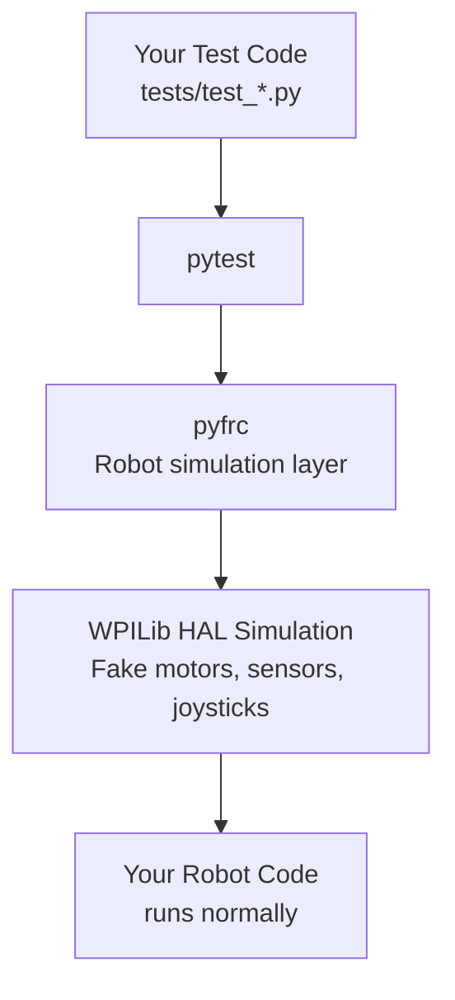
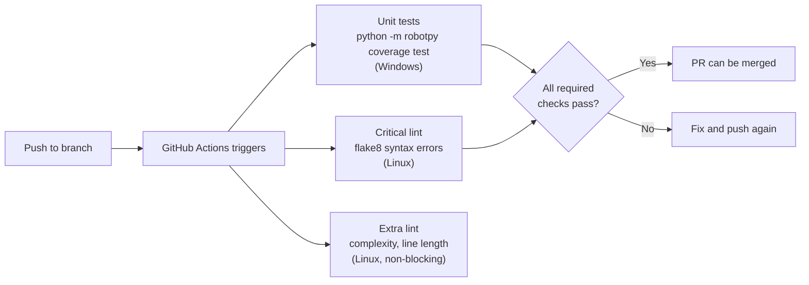

# Testing Robot Code

Welcome! This guide explains how we test robot code for FRC Team 3200 (Raptacon). If you are new to programming or new to FRC, start here. Testing might sound boring, but it is one of the most valuable skills you can learn — and it will save your team from crashes during a real match.

---

## 1. Why Test Robot Code?

### Hardware is expensive and breaks

Motors, controllers, and sensors cost hundreds of dollars. Running untested code on the real robot risks burning out hardware or breaking mechanisms. Testing in software first is free.

### Competition time is limited

At a tournament you might get 3 practice matches before the competition starts. There is no time to debug a crash on the field. Tests run in seconds and catch bugs before you ever touch the robot.

### "If it's not tested, it's broken"

This is a common saying among experienced engineers. If you added code that was never run through any test, you do not know if it works. Treat untested code as broken until proven otherwise.

### Tests catch bugs automatically

Once a test is written, it runs every single time someone changes the code. If a new feature accidentally breaks something old, the test fails immediately and tells you exactly what broke.

### CI ensures nobody merges broken code

When you open a Pull Request on GitHub, tests run automatically. Code that breaks tests cannot be merged. This protects everyone on the team.

---

## 2. The Testing Stack

Three layers work together to let you test robot code without a physical robot:



**pytest** is a standard Python testing framework. You write functions that check conditions using `assert`, and pytest runs them and reports failures.

**pyfrc** is RobotPy's testing extension. It plugs into pytest and creates a full simulated robot environment — fake motors, fake sensors, a fake driver station, fake joysticks — so your robot code runs the same way it would on real hardware, but entirely in software.

**WPILib HAL Simulation** is the layer underneath pyfrc. "HAL" stands for Hardware Abstraction Layer. In simulation mode it replaces every hardware call (SparkMax, NavX, CANcoder, etc.) with software objects you can read and write programmatically.

---

## 3. Running Tests

```bash
# Run all tests
python -m robotpy test

# Run with a coverage report (shows which lines were executed)
python -m robotpy coverage test

# Run one specific file (add -v for verbose output)
python -m robotpy test -- tests/test_intake.py -v

# Run one specific test function
python -m robotpy test -- tests/test_intake.py::test_activate_roller -v
```

Tests also run automatically when you deploy to the robot:

```bash
make deploy   # runs sync, then deploys — tests run as part of CI before merge
```

And locally with `make`:

```bash
make test     # runs lint, then all tests
```

---

## 4. Writing Your First Test (Pytest Style)

### The rules

- Test files go in the `tests/` directory and are named `test_*.py`.
- Test functions are named `test_*`.
- Use plain `assert` statements — do **not** use `unittest.TestCase`.
- Group related tests in a plain class (no `TestCase` inheritance needed).

### assert statements

An `assert` checks that something is true. If it is false, the test fails and tells you exactly which line failed.

```python
assert 1 + 1 == 2         # passes
assert "hello".upper() == "HELLO"   # passes
assert 1 + 1 == 3         # FAILS — pytest shows this line and the values
```

### A simple example

```python
# tests/test_flywheel.py
import pytest

def test_flywheel_starts_at_zero(robot):
    """Flywheel should start with no speed."""
    flywheel = robot.container.flywheel
    assert flywheel.get_speed() == 0.0

def test_flywheel_stops_after_running(robot):
    """Flywheel should output 0 after stop() is called."""
    flywheel = robot.container.flywheel
    flywheel.set_speed(0.8)
    flywheel.stop()
    assert flywheel._motor.get() == pytest.approx(0.0)
```

Notice `pytest.approx()` — floating point math is imprecise, so use this instead of `==` when comparing decimals.

### Fixtures

A **fixture** is a function that sets up something your test needs. pytest runs fixtures automatically and passes the result to your test function as a parameter.

The `robot` fixture above is provided by pyfrc. It starts the simulated robot and gives you access to everything on it. You do not need to create it yourself — just add `robot` as a parameter to your test function.

You can also write your own fixtures:

```python
import pytest
from subsystem.intakeactions import IntakeSubsystem

@pytest.fixture(scope="module")
def intake():
    """Create one IntakeSubsystem for the whole test module."""
    return IntakeSubsystem()

def test_activate_roller(intake):
    """activateRoller sets rollerCondition to 1."""
    intake.activateRoller()
    assert intake.rollerCondition == 1
```

The `scope="module"` means the fixture is created once and reused by all tests in the file — useful when creating hardware objects (like SparkMax) that can only be created once.

### Real example from our codebase

Here is a real test from `tests/test_intake.py`:

```python
def test_motor_checks_applies_velocity(intake):
    """motorChecks sets motor output to rollerCondition * rollerVelocity."""
    intake.rollerVelocity = 0.3
    intake.rollerCondition = 1
    intake.motorChecks()
    assert intake.rollerMotor.get() == pytest.approx(0.3)

def test_motor_checks_zero_when_deactivated(intake):
    """motorChecks sets motor output to 0 when rollerCondition is 0."""
    intake.rollerVelocity = 0.5
    intake.rollerCondition = 0
    intake.motorChecks()
    assert intake.rollerMotor.get() == pytest.approx(0.0)
```

Each test has a clear docstring, sets up state explicitly, calls one function, and checks the result. That is all there is to it.

---

## 5. pyfrc Simulation

pyfrc creates a complete simulated robot environment. When your test runs:

- Motors do not spin, but all motor controller code runs and motor output values can be read.
- Sensors (encoders, gyros, absolute encoders) can be set programmatically.
- The driver station (enabled/disabled, teleop/auto) can be controlled.
- Joystick inputs can be injected.
- The full robot lifecycle (init, periodic) runs just like on a real robot.

This catches the most common bugs:

- `NoneType` errors (forgetting to check for `None` before using a subsystem)
- Logic errors in command scheduling
- Division by zero in drive math
- Crashes that only happen in certain robot modes

Full pyfrc documentation: https://robotpy.readthedocs.io/projects/pyfrc/en/stable/

---

## 6. Fuzz Testing

Fuzz testing means feeding **random inputs** to the robot code to see if anything crashes. Think of it like a toddler mashing every button on the Xbox controller at the same time, hundreds of times in a row. If the robot code survives without crashing, it is pretty robust.

Our fuzz tests live in `tests/test_fuzz_teleop.py`. They simulate a complete FRC match:

1. Disabled (0.5 s) — robot boots, subsystems initialize
2. Autonomous (1.0 s) — auto routine runs
3. Teleop (N cycles) — random controller inputs every 20 ms
4. Disabled (0.5 s) — robot shuts down

Each cycle generates a new set of random inputs: sticks, buttons, triggers, and D-pad. The test checks after every single cycle that `robot_is_alive` is still `True`.

### Seeded randomness = reproducible failures

Each test uses a fixed seed number (like `seed=42`). This makes the "random" inputs the same every time you run the test. If a test fails, anyone on the team can re-run it and get the exact same failure — making bugs easy to reproduce and fix.

```bash
# Quick smoke test (100 cycles)
python -m robotpy test -- tests/test_fuzz_teleop.py::test_fuzz_teleop_short -v

# Standard fuzz test (500 cycles, 10 seconds of simulated match time)
python -m robotpy test -- tests/test_fuzz_teleop.py::test_fuzz_teleop_default -v

# Extreme inputs only (axes snap to -1, 0, or +1 every cycle)
python -m robotpy test -- tests/test_fuzz_teleop.py::test_fuzz_teleop_all_extremes -v

# Long fuzz (5000 cycles — runs in CI, takes longer locally)
python -m robotpy test -- tests/test_fuzz_teleop.py::test_fuzz_teleop_long -v
```

### What to do when a fuzz test fails

1. Read the error message — it will show the exception and the seed number.
2. Run just that test to see the full traceback.
3. The traceback points to the line in your subsystem or command code that crashed.
4. Fix the bug in your code (not in the test file).
5. Re-run the tests to confirm the fix.

Common fixes:
- Add a `None` check before using a subsystem that might not exist.
- Handle edge cases in math (like division by zero when a stick is at exactly 0).
- Make sure commands do not conflict when two buttons are pressed together.

---

## 7. Testing the Subsystem Registry

Our robot uses a registry pattern to create subsystems. Each subsystem can be `enabled`, `disabled`, or `required`. Tests in `tests/test_subsystem_factory.py` verify that this registry behaves correctly.

```python
from utils.subsystem_factory import SubsystemRegistry, SubsystemEntry, SubsystemState

def test_disabled_subsystem_is_not_created():
    """A disabled subsystem should not be created — creator is never called."""
    entry = SubsystemEntry(
        name="test_sub",
        default_state=SubsystemState.disabled,
        creator=lambda subs: "this should never run",
    )
    registry = SubsystemRegistry([entry])
    assert registry.get("test_sub") is None
```

Other things the factory tests check:

- An `enabled` subsystem that raises an exception during creation returns `None` (graceful degradation).
- A `required` subsystem that raises an exception during creation re-raises the error (hard failure).
- A subsystem whose dependency was not created is automatically skipped.
- Controls modules (`commands/{name}_controls.py`) are discovered and called automatically.
- `updateTelemetry()` is called on subsystems that have it, and silently skipped for ones that do not.

---

## 8. Testing Graceful Degradation

A key design goal of our robot is that it keeps running even when hardware fails. If a swerve module's CAN bus times out during initialization, the robot should still start up and let other mechanisms work.

Tests in `tests/test_robot_degraded.py` simulate this by injecting failures into subsystem creators:

```python
def _failing_creator(subs):
    """Simulates a hardware failure during subsystem creation."""
    raise RuntimeError("CAN bus timeout — simulated hardware failure")
```

Then they verify the registry handled it correctly:

```python
def test_one_module_fails_robot_cycles():
    """
    One swerve module throws during creation. The drivetrain is
    skipped (missing dependency), but the turret and other modules
    are created. Robot cycles through all modes without crashing.
    """
    # ... (build manifest with one failing module creator)
    registry = _make_registry(entries)

    assert registry.get("swerve_module_frontLeft") is None  # failed
    assert registry.get("drivetrain") is None               # skipped (dependency missing)
    assert registry.get("turret") is not None               # unaffected

    # Simulate a full match — must not raise
    _simulate_robot_lifecycle(registry)
```

The degradation tests also verify that `RobotSwerve`'s mode handlers (`teleopInit`, `autonomousPeriodic`, etc.) all handle `drivetrain is None` without crashing.

---

## 9. CI Pipeline

Every time someone pushes code or opens a Pull Request, GitHub Actions runs the tests automatically. Here is what the pipeline does:



Key facts about our CI:

- Tests run on **Windows** (matching what many students use locally).
- The critical lint check (`flake8`) catches syntax errors and undefined names — this **blocks** merging.
- The extra lint check catches style issues — this is **non-blocking** (a warning, not a failure).
- Both tests and critical lint must pass before code can merge to `main`.
- CI also builds and deploys documentation automatically on merges to `main`.

The CI workflow is defined in `.github/workflows/robot_ci.yml`.

---

## 10. Common Testing Mistakes

### Testing implementation instead of behavior

Bad:
```python
# This tests internal state we should not care about
assert intake._internal_flag == True
```

Good:
```python
# This tests what the subsystem DOES
intake.activateRoller()
assert intake.rollerMotor.get() == pytest.approx(0.3)
```

Test what a subsystem does from the outside, not how it stores things internally.

### Not cleaning up state between tests

If one test sets `intake.rollerCondition = 1` and the next test assumes it starts at 0, you get a flaky test that passes or fails depending on order. Use an `autouse` fixture to reset state:

```python
@pytest.fixture(autouse=True)
def _reset_state(intake):
    """Reset intake state before each test."""
    intake.rollerCondition = 0
    intake.rollerVelocity = 0
    intake.jamDetected = False
```

The `autouse=True` means pytest runs this fixture automatically before every test in the file, without you having to add it as a parameter.

### Skipping simulation tests because "hardware is different"

Simulation catches logic errors, None checks, command conflicts, and math bugs. The fact that a motor is simulated does not mean the test is worthless. Write the test.

### Not testing edge cases

Always ask: what happens at the boundaries?

- What if speed is `0`? `-1`? `2.0` (out of range)?
- What if the joystick is at exactly `0.0`? Does the drive math divide by it?
- What if a subsystem is `None`?

Our fuzz tests catch many edge cases automatically, but specific unit tests for known edge cases are even better because they document your intent.

---

## 11. What Claude-Generated Tests Look Like

Per our team convention, tests that were generated with AI assistance are marked with a comment so the team knows:

```python
# Unit test generated by Claude
def test_something():
    """Description of what this tests."""
    ...
```

You will see this comment at the top of several test files and on individual test functions in our codebase. This is not a mark of lower quality — it is just transparency about how the test was written.

---

## Further Reading

- **pyfrc documentation**: https://robotpy.readthedocs.io/projects/pyfrc/en/stable/
- **pytest documentation**: https://docs.pytest.org/en/stable/
- **Our CI workflow**: `.github/workflows/robot_ci.yml`
- **Our test files**: `tests/test_fuzz_teleop.py`, `tests/test_subsystem_factory.py`, `tests/test_robot_degraded.py`, `tests/test_intake.py`, `tests/test_swerve_mechanism.py`, `tests/test_loop_timing.py`
