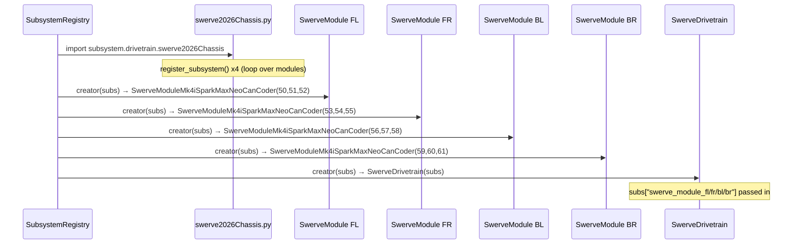
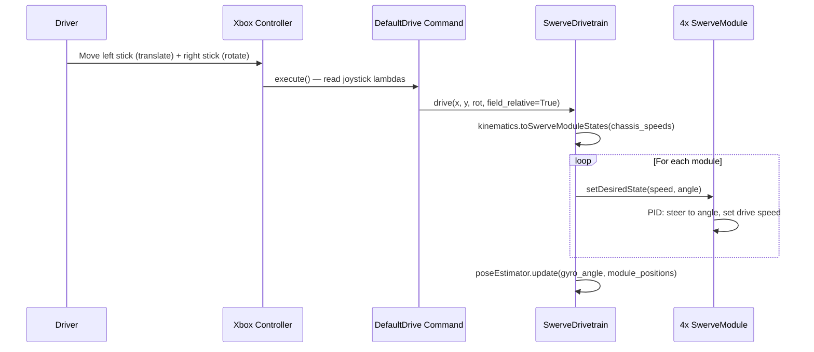
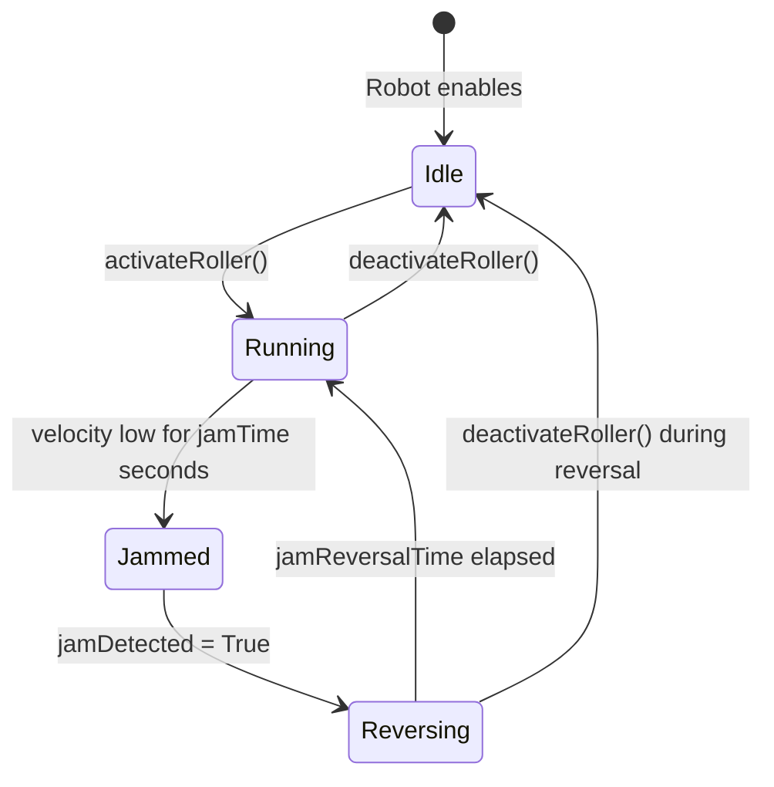
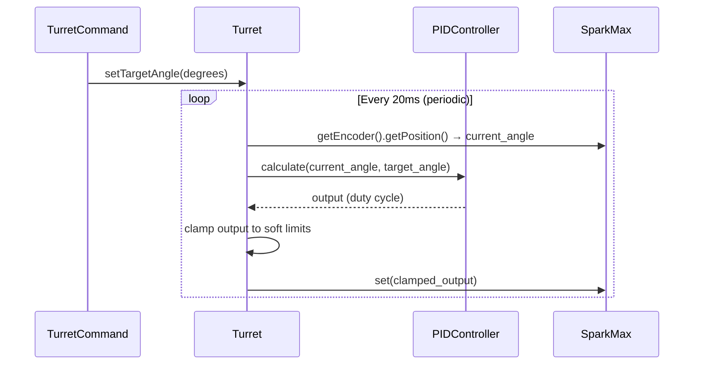
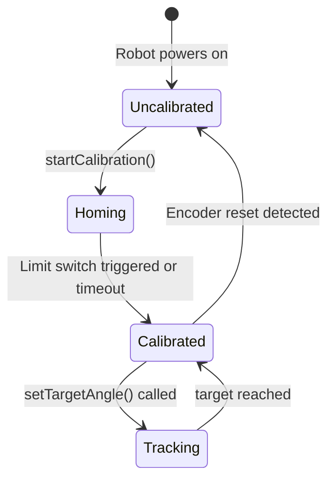

# Subsystems

This directory contains all hardware subsystems for the Raptacon 2026 robot. Each subsystem is a Python class that owns and controls one physical mechanism.

For a deep dive on how subsystems are created and managed at startup, see [docs/architecture/subsystem-registry.md](../docs/architecture/subsystem-registry.md).

---

## What is a Subsystem?

A subsystem wraps **one physical mechanism**. It creates the hardware objects (motors, encoders, sensors), exposes clean methods for interacting with that hardware, and tells the command scheduler which hardware it owns.

Rules for a good subsystem:
- **Owns its hardware** — motors and sensors are created in `__init__` and not shared
- **Exposes methods, not hardware** — commands call `intake.activate()`, not `intake.rollerMotor.set(0.5)`
- **Knows nothing about buttons** — button-to-command wiring belongs in `commands/{name}_controls.py`
- **Reports telemetry** — implement `updateTelemetry()` so the dashboard shows what the mechanism is doing
- **Stops safely on disable** — implement `onDisabledInit()` to stop motors when the robot disables

---

## Directory Structure

```
subsystem/
├── __init__.py              # One import per subsystem — triggers self-registration
├── manifest.py              # Maps robot names to which subsystems to create
├── CAN_CONFIG.md            # CAN bus ID assignments (check here before picking an ID)
│
├── drivetrain/              # Swerve drive system
│   ├── swerve2026Chassis.py # Registers the 4 individual wheel modules
│   └── swerve_drivetrain.py # The full SwerveDrivetrain subsystem
│
├── localization/            # Field position tracking
│   └── localization.py
│
└── mechanisms/              # Game mechanisms (intake, turret, etc.)
    └── turret.py
```

---

## Subsystem Index

| Subsystem | Class | State | Description |
|---|---|---|---|
| `swerve_module_fl/fr/bl/br` | `SwerveModuleMk4iSparkMaxNeoCanCoder` | required | Individual swerve wheel modules |
| `drivetrain` | `SwerveDrivetrain` | required | Full 4-module swerve drive with NavX and path planning |
| `intake` | `IntakeSubsystem` | enabled | Roller intake with jam detection |
| `turret` | `Turret` | enabled | Rotating turret with PID control and SysId |
| `localization` | `Localization` | enabled | Vision-based pose estimation (depends on drivetrain) |

---

## Drivetrain (`drivetrain/`)

### Overview

The drivetrain is a **4-module MK4i swerve** system. Each corner has its own drive motor (NEO, SparkMax), steer motor (NEO, SparkMax), and absolute encoder (CANcoder). The gyroscope is a NavX.

```
[FL]───────[FR]
  │  chassis  │
[BL]───────[BR]
```

Each wheel can rotate independently, allowing the robot to drive in any direction without turning the robot body (field-relative control).

### CAN ID Layout

Modules use consecutive CAN IDs starting at 50. Within each module: `base = drive`, `base+1 = steer`, `base+2 = encoder`.

| Module | Drive | Steer | Encoder |
|---|---|---|---|
| Front Left | 50 | 51 | 52 |
| Front Right | 53 | 54 | 55 |
| Back Left | 56 | 57 | 58 |
| Back Right | 59 | 60 | 61 |

See [CAN_CONFIG.md](CAN_CONFIG.md) for the full CAN layout including mechanisms.

### Startup Sequence

The drivetrain depends on all four swerve modules, so modules are always created first. The registry enforces this order via topological sort.



### Teleop Drive Loop (every 20ms)



### Key Public Methods

| Method | Description |
|---|---|
| `drive(xSpeed, ySpeed, rot, fieldRelative)` | Main drive command. Called every 20ms by DefaultDrive. |
| `reset_heading()` | Zero the gyroscope heading (used at match start). |
| `get_pose()` | Returns current field position as `Pose2d`. |
| `reset_pose(pose)` | Set the known position (called by autonomous init). |
| `set_motor_stop_modes(...)` | Switch motors between brake and coast mode. |

---

## Intake (`intakeactions.py`)

### Overview

The intake uses a roller motor to pull game pieces into the robot. It includes **jam detection**: if the roller stalls (low velocity while commanded to run), the intake automatically reverses briefly to clear the jam.

### State Machine



### How Jam Detection Works

Every 20ms while the roller is active:
1. Read encoder velocity
2. If velocity < `jamThreshold` RPM for more than `jamTime` seconds → set `jamDetected = True`
3. While jammed: reverse the motor at `-unjam` RPM for `jamReversalTime` seconds
4. After reversal: clear `jamDetected`, resume normal operation

The thresholds (`jamThreshold`, `jamTime`, `jamReversalTime`) are tunable at runtime via NetworkTables.

### NetworkTables Telemetry

Published every cycle by `updateTelemetry()`:

| NT Key | Value | Description |
|---|---|---|
| `/subsystem/intake/rollerVelocity` | float | Target speed (persistent, tunable) |
| `/subsystem/intake/rollerPosition` | float | Encoder position |
| `/subsystem/intake/rollerEncoderVelocity` | float | Actual roller RPM |
| `/subsystem/intake/rollerCondition` | int | 0 = stopped, 1 = running |
| `/subsystem/intake/jamDetected` | bool | True when jam is detected |

### Key Public Methods

| Method | Description |
|---|---|
| `activateRoller()` | Set rollerCondition to 1 (start rolling) |
| `deactivateRoller()` | Set rollerCondition to 0 (stop) |
| `motorChecks()` | Apply rollerCondition × rollerVelocity to motor (called each cycle) |
| `jamDetection()` | Run jam detection state machine (called each cycle) |

---

## Turret (`mechanisms/turret.py`)

### Overview

The turret is a rotating mechanism with a SparkMax motor controlled by a software PID loop. It supports:
- **Position control** via PID to specific angles
- **Soft limits** (min/max angle in software, before hitting mechanical stops)
- **Position calibration** — the turret can home to a known position
- **SysId characterization** — for measuring motor constants to tune feedforward

### Position Control Loop (every 20ms)



### Calibration

The turret uses `PositionCalibration` to handle the fact that encoder position resets to 0 when the robot powers on. Calibration stores a known physical position in NetworkTables (persistent), so after a power cycle the turret knows where it is relative to the robot.



### NetworkTables Telemetry

| NT Key | Description |
|---|---|
| `/subsystem/turret/angle` | Current turret angle in degrees |
| `/subsystem/turret/targetAngle` | Commanded target angle |
| `/subsystem/turret/pidOutput` | PID controller output |
| `/subsystem/turret/calibrated` | True when position is known |

---

## Adding a New Subsystem

See [docs/architecture/adding-a-subsystem.md](../docs/architecture/adding-a-subsystem.md) for a complete step-by-step guide.

**Quick checklist:**

- [ ] Create class in `subsystem/mechanisms/` extending `commands2.Subsystem`
- [ ] Add `updateTelemetry()` to publish data each cycle
- [ ] Add `onDisabledInit()` to stop motors on disable
- [ ] Add `register_subsystem(name=..., state=..., creator=...)` at bottom of file
- [ ] Add one import line to `subsystem/__init__.py`
- [ ] Optionally create `commands/{name}_controls.py`
- [ ] Check [CAN_CONFIG.md](CAN_CONFIG.md) before picking a CAN ID
